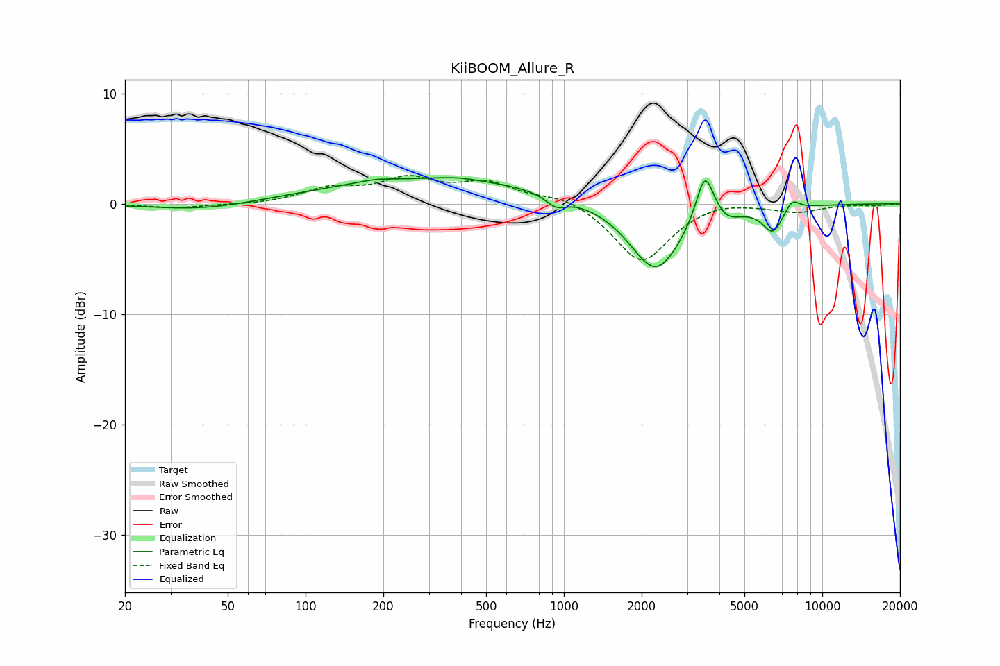

# KiiBOOM_Allure_R
See [usage instructions](https://github.com/jaakkopasanen/AutoEq#usage) for more options and info.

### Parametric EQs
Apply preamp of -2.5 dB when using parametric equalizer.

|   # | Type    |   Fc (Hz) |    Q |   Gain (dB) |
|-----|---------|-----------|------|-------------|
|   1 | Peaking |        40 | 0.72 |        -0.7 |
|   2 | Peaking |       187 | 2.23 |         0.2 |
|   3 | Peaking |       318 | 0.3  |         2.2 |
|   4 | Peaking |       386 | 1.8  |         0.2 |
|   5 | Peaking |       932 | 3.56 |        -1   |
|   6 | Peaking |      2267 | 1.4  |        -6.3 |
|   7 | Peaking |      3515 | 4.04 |         4.7 |
|   8 | Peaking |      4300 | 2.92 |        -0.8 |
|   9 | Peaking |      6440 | 3.49 |        -2.3 |
|  10 | Peaking |      7647 | 4.8  |         1.1 |

### Fixed Band EQs
When using fixed band (also called graphic) equalizer, apply preamp of **-2.7 dB** (if available) and set gains manually with these parameters.

|   # | Type    |   Fc (Hz) |    Q |   Gain (dB) |
|-----|---------|-----------|------|-------------|
|   1 | Peaking |        31 | 1.41 |        -0.4 |
|   2 | Peaking |        62 | 1.41 |        -0.1 |
|   3 | Peaking |       125 | 1.41 |         1.3 |
|   4 | Peaking |       250 | 1.41 |         2   |
|   5 | Peaking |       500 | 1.41 |         1.7 |
|   6 | Peaking |      1000 | 1.41 |         0.8 |
|   7 | Peaking |      2000 | 1.41 |        -5.4 |
|   8 | Peaking |      4000 | 1.41 |         0.5 |
|   9 | Peaking |      8000 | 1.41 |        -0.7 |
|  10 | Peaking |     16000 | 1.41 |        -0.1 |

### Graphs

