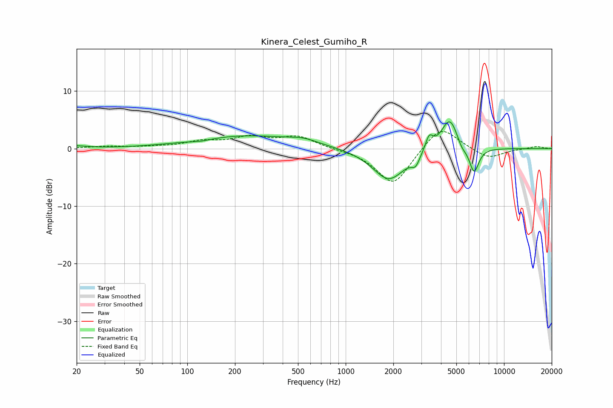

# Kinera_Celest_Gumiho_R
See [usage instructions](https://github.com/jaakkopasanen/AutoEq#usage) for more options and info.

### Parametric EQs
Apply preamp of -4.7 dB when using parametric equalizer.

|   # | Type    |   Fc (Hz) |    Q |   Gain (dB) |
|-----|---------|-----------|------|-------------|
|   1 | Peaking |        20 | 1.96 |         0.4 |
|   2 | Peaking |       121 | 2.09 |        -0.3 |
|   3 | Peaking |       236 | 0.42 |         2.2 |
|   4 | Peaking |       541 | 1.57 |         0.7 |
|   5 | Peaking |      1875 | 1.36 |        -5.6 |
|   6 | Peaking |      2763 | 5.53 |        -1.7 |
|   7 | Peaking |      3366 | 5.99 |         2.5 |
|   8 | Peaking |      4550 | 2.55 |         5.8 |
|   9 | Peaking |      5387 | 4.52 |        -1.3 |
|  10 | Peaking |      6467 | 4.5  |        -4.6 |

### Fixed Band EQs
When using fixed band (also called graphic) equalizer, apply preamp of **-3.1 dB** (if available) and set gains manually with these parameters.

|   # | Type    |   Fc (Hz) |    Q |   Gain (dB) |
|-----|---------|-----------|------|-------------|
|   1 | Peaking |        31 | 1.41 |         0.3 |
|   2 | Peaking |        62 | 1.41 |         0.2 |
|   3 | Peaking |       125 | 1.41 |         1.1 |
|   4 | Peaking |       250 | 1.41 |         1.8 |
|   5 | Peaking |       500 | 1.41 |         2   |
|   6 | Peaking |      1000 | 1.41 |        -0.1 |
|   7 | Peaking |      2000 | 1.41 |        -6.4 |
|   8 | Peaking |      4000 | 1.41 |         4.3 |
|   9 | Peaking |      8000 | 1.41 |        -1.8 |
|  10 | Peaking |     16000 | 1.41 |         0.4 |

### Graphs

