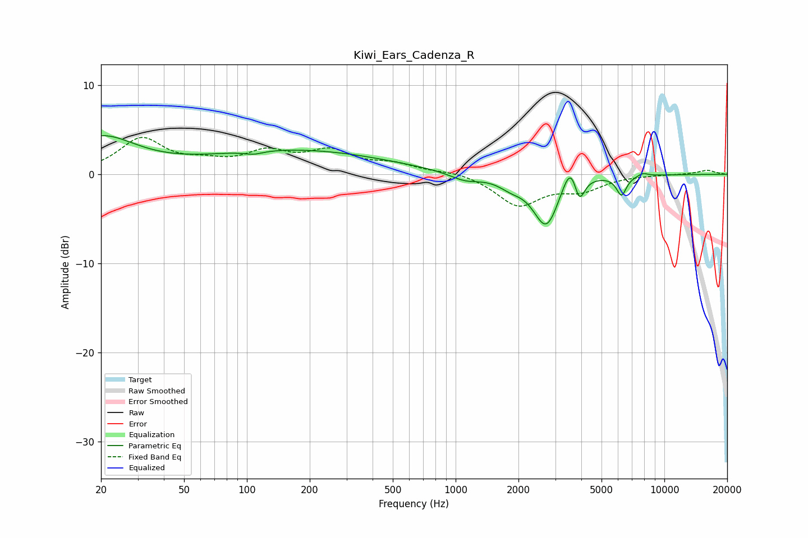

# Kiwi_Ears_Cadenza_R
See [usage instructions](https://github.com/jaakkopasanen/AutoEq#usage) for more options and info.

### Parametric EQs
Apply preamp of -4.4 dB when using parametric equalizer.

|   # | Type    |   Fc (Hz) |    Q |   Gain (dB) |
|-----|---------|-----------|------|-------------|
|   1 | Peaking |        20 | 0.85 |         4   |
|   2 | Peaking |       108 | 3.17 |        -0.4 |
|   3 | Peaking |       171 | 0.32 |         2.7 |
|   4 | Peaking |      1107 | 1.91 |        -0.9 |
|   5 | Peaking |      1843 | 2.35 |        -0.9 |
|   6 | Peaking |      2722 | 2.26 |        -5.9 |
|   7 | Peaking |      3593 | 3.47 |         3.7 |
|   8 | Peaking |      3901 | 5.3  |        -3.6 |
|   9 | Peaking |      6233 | 5.84 |        -2.2 |
|  10 | Peaking |      7886 | 5.51 |         0.4 |

### Fixed Band EQs
When using fixed band (also called graphic) equalizer, apply preamp of **-4.2 dB** (if available) and set gains manually with these parameters.

|   # | Type    |   Fc (Hz) |    Q |   Gain (dB) |
|-----|---------|-----------|------|-------------|
|   1 | Peaking |        31 | 1.41 |         3.9 |
|   2 | Peaking |        62 | 1.41 |         1   |
|   3 | Peaking |       125 | 1.41 |         2.2 |
|   4 | Peaking |       250 | 1.41 |         2.3 |
|   5 | Peaking |       500 | 1.41 |         1   |
|   6 | Peaking |      1000 | 1.41 |         0.4 |
|   7 | Peaking |      2000 | 1.41 |        -3.4 |
|   8 | Peaking |      4000 | 1.41 |        -1.6 |
|   9 | Peaking |      8000 | 1.41 |        -0   |
|  10 | Peaking |     16000 | 1.41 |         0.5 |

### Graphs

