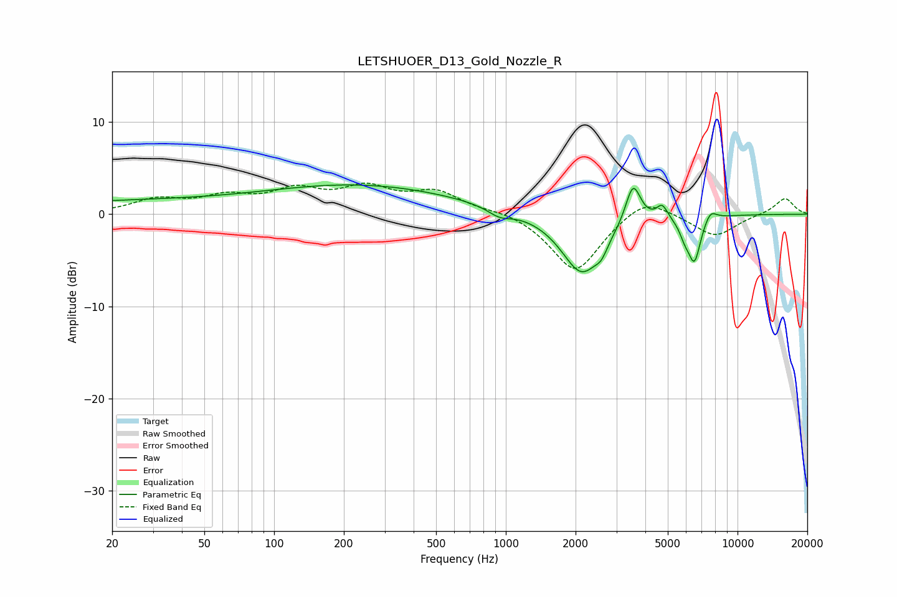

# LETSHUOER_D13_Gold_Nozzle_R
See [usage instructions](https://github.com/jaakkopasanen/AutoEq#usage) for more options and info.

### Parametric EQs
Apply preamp of -3.3 dB when using parametric equalizer.

|   # | Type    |   Fc (Hz) |    Q |   Gain (dB) |
|-----|---------|-----------|------|-------------|
|   1 | Peaking |        37 | 0.18 |         1.5 |
|   2 | Peaking |       284 | 0.37 |         2.6 |
|   3 | Peaking |       940 | 2.81 |        -0.9 |
|   4 | Peaking |      2129 | 1.6  |        -6.5 |
|   5 | Peaking |      2587 | 5.59 |        -1.1 |
|   6 | Peaking |      3539 | 4.31 |         4.4 |
|   7 | Peaking |      4731 | 5.92 |         1.5 |
|   8 | Peaking |      5914 | 5.99 |        -1.3 |
|   9 | Peaking |      6516 | 5.05 |        -4.8 |
|  10 | Peaking |      7639 | 5.18 |         1.1 |

### Fixed Band EQs
When using fixed band (also called graphic) equalizer, apply preamp of **-3.5 dB** (if available) and set gains manually with these parameters.

|   # | Type    |   Fc (Hz) |    Q |   Gain (dB) |
|-----|---------|-----------|------|-------------|
|   1 | Peaking |        31 | 1.41 |         1.5 |
|   2 | Peaking |        62 | 1.41 |         1.6 |
|   3 | Peaking |       125 | 1.41 |         2.3 |
|   4 | Peaking |       250 | 1.41 |         2.5 |
|   5 | Peaking |       500 | 1.41 |         2.2 |
|   6 | Peaking |      1000 | 1.41 |         0.5 |
|   7 | Peaking |      2000 | 1.41 |        -6.4 |
|   8 | Peaking |      4000 | 1.41 |         2.2 |
|   9 | Peaking |      8000 | 1.41 |        -2.4 |
|  10 | Peaking |     16000 | 1.41 |         1.8 |

### Graphs

