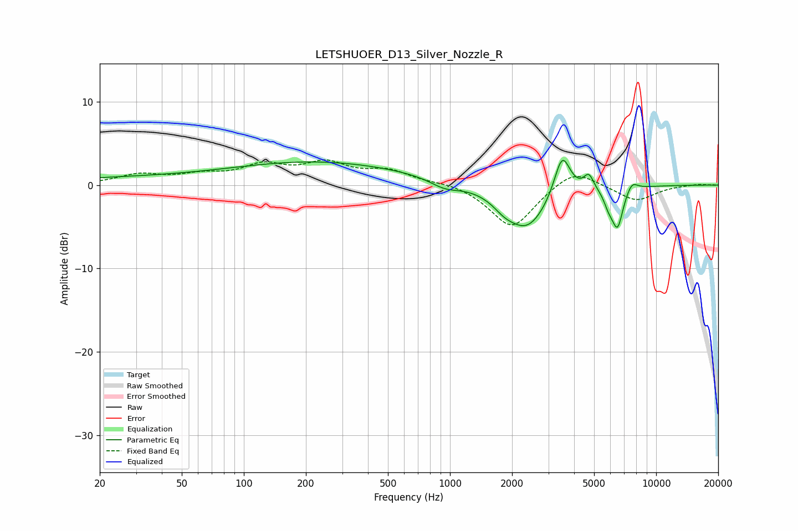

# LETSHUOER_D13_Silver_Nozzle_R
See [usage instructions](https://github.com/jaakkopasanen/AutoEq#usage) for more options and info.

### Parametric EQs
Apply preamp of -3.0 dB when using parametric equalizer.

|   # | Type    |   Fc (Hz) |    Q |   Gain (dB) |
|-----|---------|-----------|------|-------------|
|   1 | Peaking |        58 | 0.18 |         0.9 |
|   2 | Peaking |       277 | 0.33 |         2.2 |
|   3 | Peaking |       944 | 2    |        -1   |
|   4 | Peaking |      1823 | 2.94 |        -0.8 |
|   5 | Peaking |      2352 | 1.33 |        -5.3 |
|   6 | Peaking |      3500 | 3.57 |         5.2 |
|   7 | Peaking |      4714 | 5.83 |         1.8 |
|   8 | Peaking |      5881 | 5.97 |        -1.4 |
|   9 | Peaking |      6493 | 4.98 |        -4.7 |
|  10 | Peaking |      7627 | 4.94 |         1.1 |

### Fixed Band EQs
When using fixed band (also called graphic) equalizer, apply preamp of **-3.1 dB** (if available) and set gains manually with these parameters.

|   # | Type    |   Fc (Hz) |    Q |   Gain (dB) |
|-----|---------|-----------|------|-------------|
|   1 | Peaking |        31 | 1.41 |         1.2 |
|   2 | Peaking |        62 | 1.41 |         1   |
|   3 | Peaking |       125 | 1.41 |         2.1 |
|   4 | Peaking |       250 | 1.41 |         2.3 |
|   5 | Peaking |       500 | 1.41 |         1.6 |
|   6 | Peaking |      1000 | 1.41 |         0.4 |
|   7 | Peaking |      2000 | 1.41 |        -5.2 |
|   8 | Peaking |      4000 | 1.41 |         2.2 |
|   9 | Peaking |      8000 | 1.41 |        -1.9 |
|  10 | Peaking |     16000 | 1.41 |         0.1 |

### Graphs

