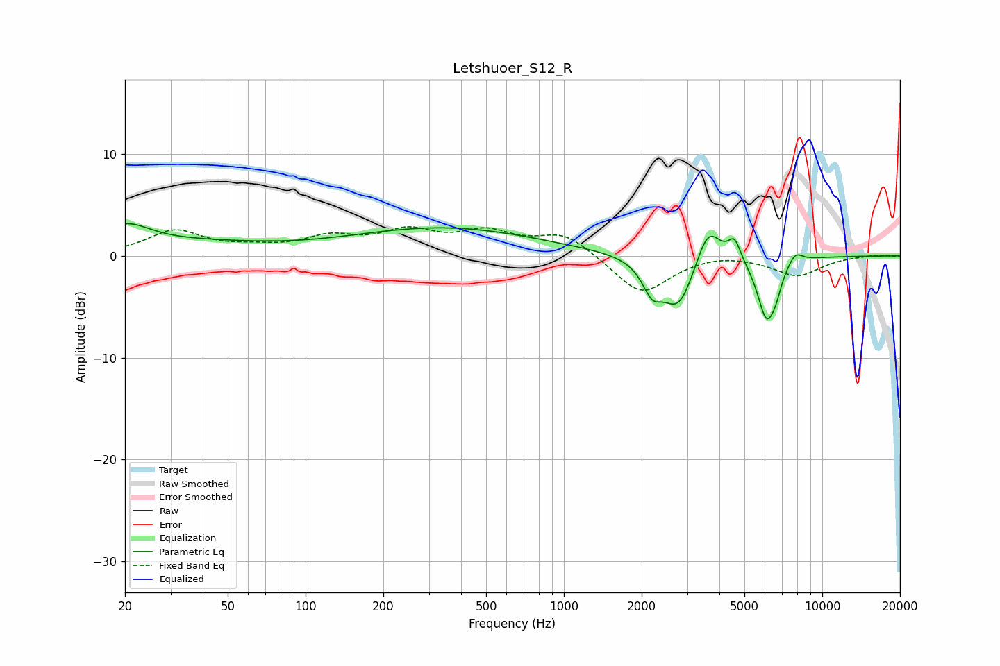

# Letshuoer_S12_R
See [usage instructions](https://github.com/jaakkopasanen/AutoEq#usage) for more options and info.

### Parametric EQs
Apply preamp of -3.3 dB when using parametric equalizer.

|   # | Type    |   Fc (Hz) |    Q |   Gain (dB) |
|-----|---------|-----------|------|-------------|
|   1 | Peaking |        20 | 1.43 |         2.4 |
|   2 | Peaking |        39 | 0.53 |         1   |
|   3 | Peaking |       344 | 0.39 |         2.7 |
|   4 | Peaking |      2195 | 3.8  |        -2.6 |
|   5 | Peaking |      2781 | 2.18 |        -5.3 |
|   6 | Peaking |      3612 | 2.85 |         4.1 |
|   7 | Peaking |      4576 | 5.99 |         2   |
|   8 | Peaking |      6089 | 3.78 |        -5.9 |
|   9 | Peaking |      6615 | 6    |        -1.3 |
|  10 | Peaking |      7868 | 4.78 |         1.1 |

### Fixed Band EQs
When using fixed band (also called graphic) equalizer, apply preamp of **-3.0 dB** (if available) and set gains manually with these parameters.

|   # | Type    |   Fc (Hz) |    Q |   Gain (dB) |
|-----|---------|-----------|------|-------------|
|   1 | Peaking |        31 | 1.41 |         2.4 |
|   2 | Peaking |        62 | 1.41 |         0.6 |
|   3 | Peaking |       125 | 1.41 |         1.6 |
|   4 | Peaking |       250 | 1.41 |         2.1 |
|   5 | Peaking |       500 | 1.41 |         2   |
|   6 | Peaking |      1000 | 1.41 |         2.2 |
|   7 | Peaking |      2000 | 1.41 |        -3.8 |
|   8 | Peaking |      4000 | 1.41 |         0.4 |
|   9 | Peaking |      8000 | 1.41 |        -1.9 |
|  10 | Peaking |     16000 | 1.41 |         0.1 |

### Graphs

