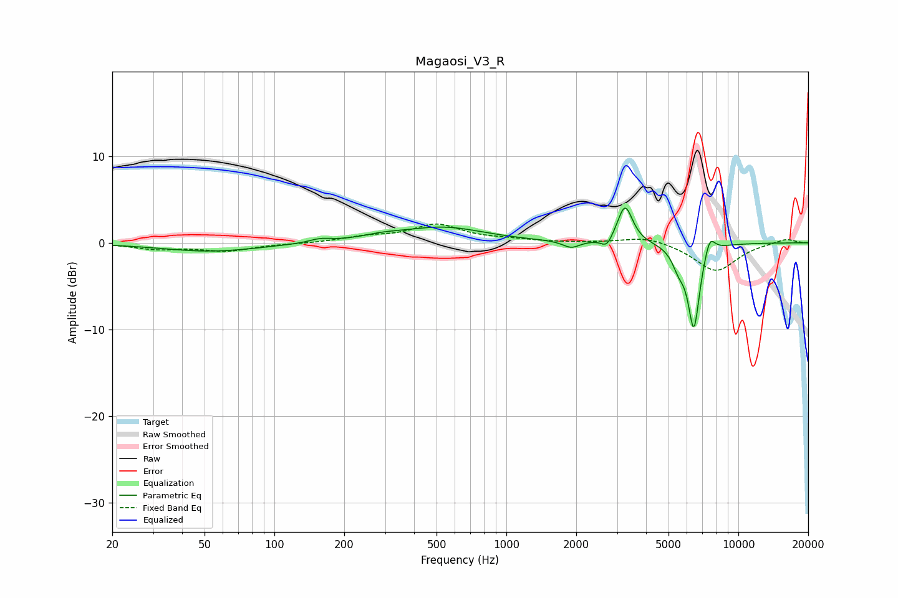

# Magaosi_V3_R
See [usage instructions](https://github.com/jaakkopasanen/AutoEq#usage) for more options and info.

### Parametric EQs
Apply preamp of -4.1 dB when using parametric equalizer.

|   # | Type    |   Fc (Hz) |    Q |   Gain (dB) |
|-----|---------|-----------|------|-------------|
|   1 | Peaking |        53 | 0.66 |        -1   |
|   2 | Peaking |       158 | 3.11 |         0.4 |
|   3 | Peaking |       291 | 1.63 |         0.4 |
|   4 | Peaking |       533 | 0.78 |         1.8 |
|   5 | Peaking |      1903 | 3.91 |        -0.8 |
|   6 | Peaking |      2709 | 5.98 |        -1.2 |
|   7 | Peaking |      3247 | 4.38 |         4.4 |
|   8 | Peaking |      5530 | 5.05 |        -1.9 |
|   9 | Peaking |      6429 | 5.31 |        -9.8 |
|  10 | Peaking |      7521 | 5.84 |         2.2 |

### Fixed Band EQs
When using fixed band (also called graphic) equalizer, apply preamp of **-2.3 dB** (if available) and set gains manually with these parameters.

|   # | Type    |   Fc (Hz) |    Q |   Gain (dB) |
|-----|---------|-----------|------|-------------|
|   1 | Peaking |        31 | 1.41 |        -0.7 |
|   2 | Peaking |        62 | 1.41 |        -0.9 |
|   3 | Peaking |       125 | 1.41 |        -0.1 |
|   4 | Peaking |       250 | 1.41 |         0.6 |
|   5 | Peaking |       500 | 1.41 |         2   |
|   6 | Peaking |      1000 | 1.41 |         0.3 |
|   7 | Peaking |      2000 | 1.41 |        -0   |
|   8 | Peaking |      4000 | 1.41 |         0.8 |
|   9 | Peaking |      8000 | 1.41 |        -3.3 |
|  10 | Peaking |     16000 | 1.41 |         0.5 |

### Graphs

