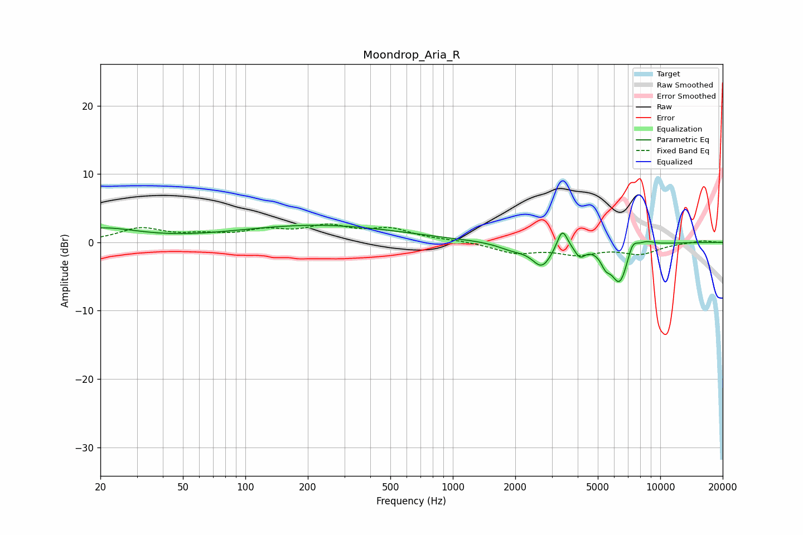

# Moondrop_Aria_R
See [usage instructions](https://github.com/jaakkopasanen/AutoEq#usage) for more options and info.

### Parametric EQs
Apply preamp of -2.6 dB when using parametric equalizer.

|   # | Type    |   Fc (Hz) |    Q |   Gain (dB) |
|-----|---------|-----------|------|-------------|
|   1 | Peaking |        20 | 0.79 |         2   |
|   2 | Peaking |       223 | 0.35 |         2.5 |
|   3 | Peaking |      1938 | 2    |        -0.9 |
|   4 | Peaking |      2691 | 2.94 |        -3.3 |
|   5 | Peaking |      3371 | 5.7  |         3.1 |
|   6 | Peaking |      4101 | 5.61 |        -1.6 |
|   7 | Peaking |      5448 | 5.95 |        -1.7 |
|   8 | Peaking |      6381 | 3.18 |        -5.9 |
|   9 | Peaking |      7345 | 5.07 |         2.1 |
|  10 | Peaking |      8528 | 3.25 |         0.7 |

### Fixed Band EQs
When using fixed band (also called graphic) equalizer, apply preamp of **-2.8 dB** (if available) and set gains manually with these parameters.

|   # | Type    |   Fc (Hz) |    Q |   Gain (dB) |
|-----|---------|-----------|------|-------------|
|   1 | Peaking |        31 | 1.41 |         1.9 |
|   2 | Peaking |        62 | 1.41 |         0.8 |
|   3 | Peaking |       125 | 1.41 |         1.5 |
|   4 | Peaking |       250 | 1.41 |         2.1 |
|   5 | Peaking |       500 | 1.41 |         1.7 |
|   6 | Peaking |      1000 | 1.41 |         0.3 |
|   7 | Peaking |      2000 | 1.41 |        -1.5 |
|   8 | Peaking |      4000 | 1.41 |        -1.5 |
|   9 | Peaking |      8000 | 1.41 |        -1.5 |
|  10 | Peaking |     16000 | 1.41 |         0.3 |

### Graphs

