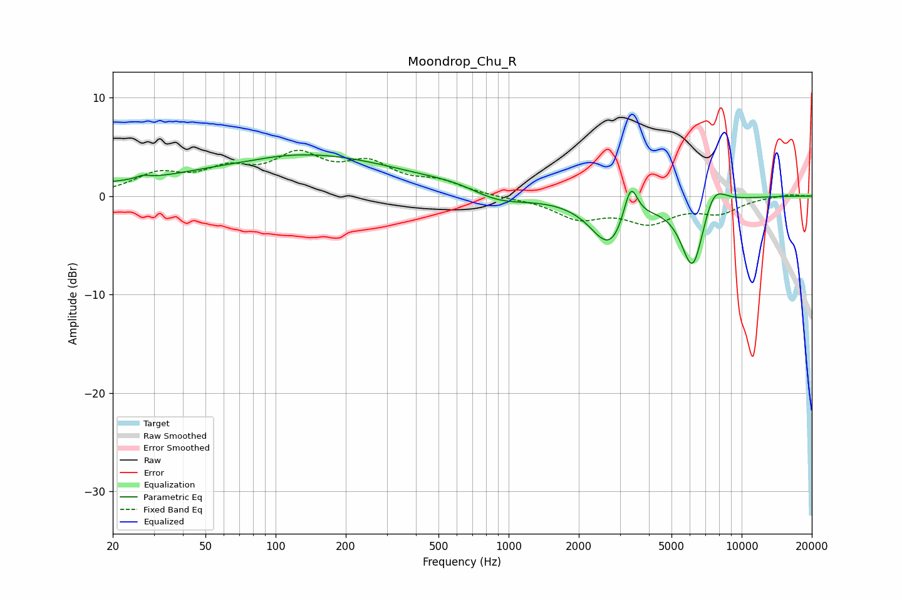

# Moondrop_Chu_R
See [usage instructions](https://github.com/jaakkopasanen/AutoEq#usage) for more options and info.

### Parametric EQs
Apply preamp of -4.3 dB when using parametric equalizer.

|   # | Type    |   Fc (Hz) |    Q |   Gain (dB) |
|-----|---------|-----------|------|-------------|
|   1 | Peaking |        25 | 0.2  |         1   |
|   2 | Peaking |        27 | 5.19 |         0.3 |
|   3 | Peaking |        76 | 1.57 |        -0.2 |
|   4 | Peaking |       149 | 0.36 |         3.8 |
|   5 | Peaking |       644 | 0.94 |         0.9 |
|   6 | Peaking |       867 | 1.06 |        -1.5 |
|   7 | Peaking |      2726 | 1.74 |        -5   |
|   8 | Peaking |      3338 | 4.63 |         4.1 |
|   9 | Peaking |      6173 | 2.68 |        -7.6 |
|  10 | Peaking |      7534 | 2.59 |         2.8 |

### Fixed Band EQs
When using fixed band (also called graphic) equalizer, apply preamp of **-4.7 dB** (if available) and set gains manually with these parameters.

|   # | Type    |   Fc (Hz) |    Q |   Gain (dB) |
|-----|---------|-----------|------|-------------|
|   1 | Peaking |        31 | 1.41 |         2   |
|   2 | Peaking |        62 | 1.41 |         2.2 |
|   3 | Peaking |       125 | 1.41 |         3.6 |
|   4 | Peaking |       250 | 1.41 |         2.8 |
|   5 | Peaking |       500 | 1.41 |         1.2 |
|   6 | Peaking |      1000 | 1.41 |        -0.1 |
|   7 | Peaking |      2000 | 1.41 |        -2.1 |
|   8 | Peaking |      4000 | 1.41 |        -2.4 |
|   9 | Peaking |      8000 | 1.41 |        -1.5 |
|  10 | Peaking |     16000 | 1.41 |         0.2 |

### Graphs

