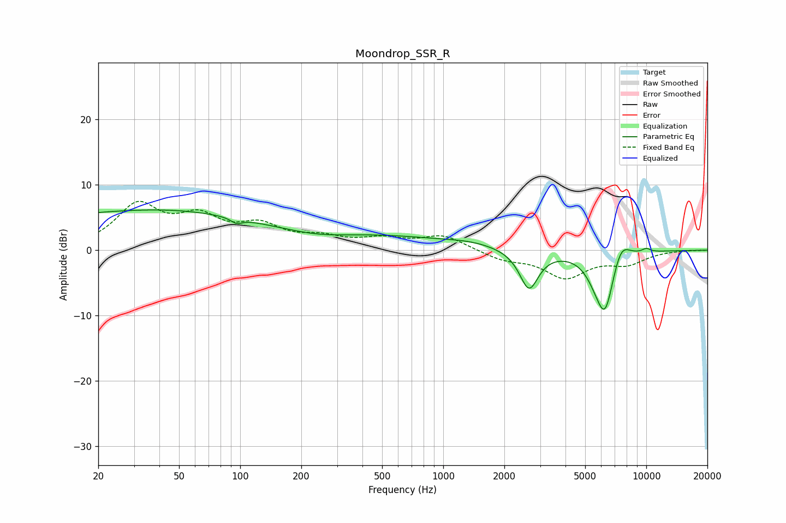

# Moondrop_SSR_R
See [usage instructions](https://github.com/jaakkopasanen/AutoEq#usage) for more options and info.

### Parametric EQs
Apply preamp of -6.3 dB when using parametric equalizer.

|   # | Type    |   Fc (Hz) |    Q |   Gain (dB) |
|-----|---------|-----------|------|-------------|
|   1 | Peaking |        20 | 0.22 |         5.1 |
|   2 | Peaking |        96 | 5.12 |        -0.8 |
|   3 | Peaking |       194 | 0.18 |         2.9 |
|   4 | Peaking |       241 | 0.83 |        -1   |
|   5 | Peaking |      1369 | 1.15 |         0.6 |
|   6 | Peaking |      2646 | 3.02 |        -6.1 |
|   7 | Peaking |      5609 | 2.8  |        -1.5 |
|   8 | Peaking |      6265 | 2.89 |        -9.2 |
|   9 | Peaking |      7483 | 3    |         3.5 |
|  10 | Peaking |     10000 | 5.96 |         0.6 |

### Fixed Band EQs
When using fixed band (also called graphic) equalizer, apply preamp of **-7.6 dB** (if available) and set gains manually with these parameters.

|   # | Type    |   Fc (Hz) |    Q |   Gain (dB) |
|-----|---------|-----------|------|-------------|
|   1 | Peaking |        31 | 1.41 |         6.5 |
|   2 | Peaking |        62 | 1.41 |         4.3 |
|   3 | Peaking |       125 | 1.41 |         3.2 |
|   4 | Peaking |       250 | 1.41 |         1.5 |
|   5 | Peaking |       500 | 1.41 |         1.4 |
|   6 | Peaking |      1000 | 1.41 |         2.2 |
|   7 | Peaking |      2000 | 1.41 |        -1.3 |
|   8 | Peaking |      4000 | 1.41 |        -4   |
|   9 | Peaking |      8000 | 1.41 |        -1.9 |
|  10 | Peaking |     16000 | 1.41 |         0   |

### Graphs

