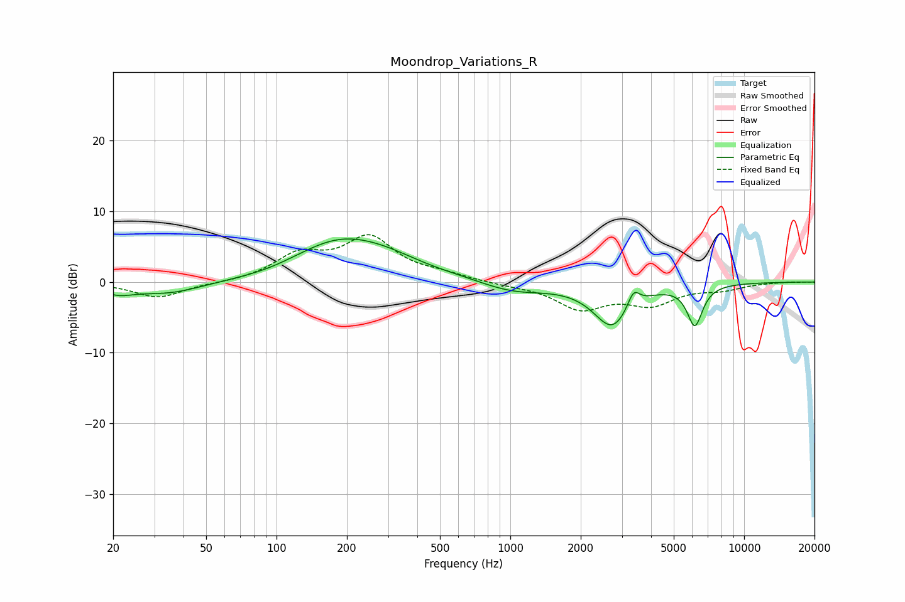

# Moondrop_Variations_R
See [usage instructions](https://github.com/jaakkopasanen/AutoEq#usage) for more options and info.

### Parametric EQs
Apply preamp of -6.2 dB when using parametric equalizer.

|   # | Type    |   Fc (Hz) |    Q |   Gain (dB) |
|-----|---------|-----------|------|-------------|
|   1 | Peaking |        21 | 2.25 |        -1.1 |
|   2 | Peaking |        34 | 0.91 |        -1.7 |
|   3 | Peaking |        92 | 0.96 |        -0.6 |
|   4 | Peaking |       187 | 0.66 |         5.8 |
|   5 | Peaking |       300 | 0.98 |         1.1 |
|   6 | Peaking |       622 | 0.9  |         0.3 |
|   7 | Peaking |      1018 | 0.94 |        -1.6 |
|   8 | Peaking |      2730 | 1.78 |        -6.1 |
|   9 | Peaking |      3364 | 5.43 |         2.5 |
|  10 | Peaking |      6154 | 4.22 |        -5.7 |

### Fixed Band EQs
When using fixed band (also called graphic) equalizer, apply preamp of **-6.8 dB** (if available) and set gains manually with these parameters.

|   # | Type    |   Fc (Hz) |    Q |   Gain (dB) |
|-----|---------|-----------|------|-------------|
|   1 | Peaking |        31 | 1.41 |        -2.2 |
|   2 | Peaking |        62 | 1.41 |        -0.2 |
|   3 | Peaking |       125 | 1.41 |         3.5 |
|   4 | Peaking |       250 | 1.41 |         6   |
|   5 | Peaking |       500 | 1.41 |         0.8 |
|   6 | Peaking |      1000 | 1.41 |        -0.3 |
|   7 | Peaking |      2000 | 1.41 |        -3.6 |
|   8 | Peaking |      4000 | 1.41 |        -2.8 |
|   9 | Peaking |      8000 | 1.41 |        -0.9 |
|  10 | Peaking |     16000 | 1.41 |         0.1 |

### Graphs

