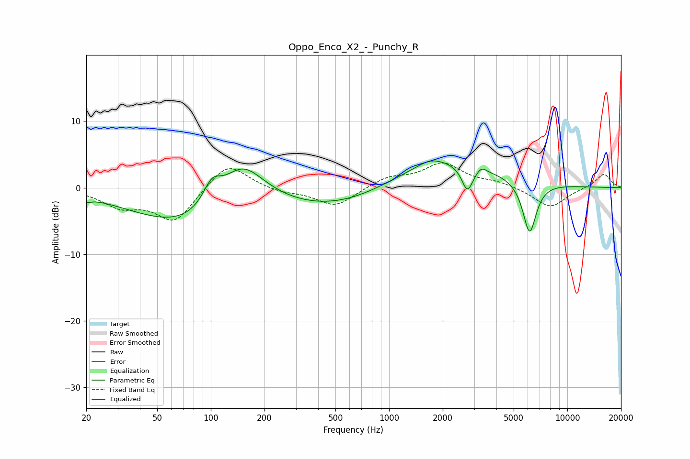

# Oppo_Enco_X2_-_Punchy_R
See [usage instructions](https://github.com/jaakkopasanen/AutoEq#usage) for more options and info.

### Parametric EQs
Apply preamp of -4.1 dB when using parametric equalizer.

|   # | Type    |   Fc (Hz) |    Q |   Gain (dB) |
|-----|---------|-----------|------|-------------|
|   1 | Peaking |        20 | 5.77 |        -0.6 |
|   2 | Peaking |        75 | 0.46 |        -6.1 |
|   3 | Peaking |       101 | 2.84 |         3.3 |
|   4 | Peaking |       149 | 1.06 |         7.3 |
|   5 | Peaking |       538 | 0.45 |        -3.4 |
|   6 | Peaking |      1710 | 1.81 |         1.1 |
|   7 | Peaking |      1889 | 0.43 |         4.4 |
|   8 | Peaking |      2750 | 4.53 |        -3.8 |
|   9 | Peaking |      3294 | 5.22 |         0.9 |
|  10 | Peaking |      6139 | 3.59 |        -8   |

### Fixed Band EQs
When using fixed band (also called graphic) equalizer, apply preamp of **-3.8 dB** (if available) and set gains manually with these parameters.

|   # | Type    |   Fc (Hz) |    Q |   Gain (dB) |
|-----|---------|-----------|------|-------------|
|   1 | Peaking |        31 | 1.41 |        -2.5 |
|   2 | Peaking |        62 | 1.41 |        -5.1 |
|   3 | Peaking |       125 | 1.41 |         4.1 |
|   4 | Peaking |       250 | 1.41 |        -0.7 |
|   5 | Peaking |       500 | 1.41 |        -2.8 |
|   6 | Peaking |      1000 | 1.41 |         1.5 |
|   7 | Peaking |      2000 | 1.41 |         3.5 |
|   8 | Peaking |      4000 | 1.41 |         0.8 |
|   9 | Peaking |      8000 | 1.41 |        -3   |
|  10 | Peaking |     16000 | 1.41 |         2.1 |

### Graphs

