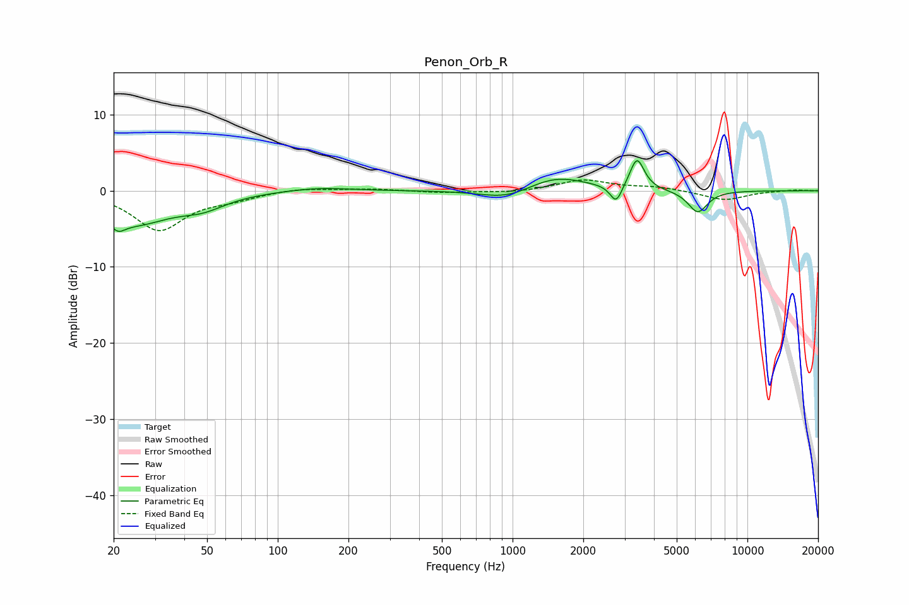

# Penon_Orb_R
See [usage instructions](https://github.com/jaakkopasanen/AutoEq#usage) for more options and info.

### Parametric EQs
Apply preamp of -4.0 dB when using parametric equalizer.

|   # | Type    |   Fc (Hz) |    Q |   Gain (dB) |
|-----|---------|-----------|------|-------------|
|   1 | Peaking |        21 | 5.39 |        -4.8 |
|   2 | Peaking |        21 | 5.88 |         3.3 |
|   3 | Peaking |        25 | 0.92 |        -4   |
|   4 | Peaking |        48 | 1.44 |        -1.5 |
|   5 | Peaking |       148 | 1.04 |         0.5 |
|   6 | Peaking |       953 | 1.24 |        -1.4 |
|   7 | Peaking |      1519 | 1.08 |         2   |
|   8 | Peaking |      2761 | 5.65 |        -2.4 |
|   9 | Peaking |      3387 | 4.7  |         4.1 |
|  10 | Peaking |      6148 | 3.29 |        -2.9 |

### Fixed Band EQs
When using fixed band (also called graphic) equalizer, apply preamp of **-1.5 dB** (if available) and set gains manually with these parameters.

|   # | Type    |   Fc (Hz) |    Q |   Gain (dB) |
|-----|---------|-----------|------|-------------|
|   1 | Peaking |        31 | 1.41 |        -5.1 |
|   2 | Peaking |        62 | 1.41 |        -0.9 |
|   3 | Peaking |       125 | 1.41 |         0.4 |
|   4 | Peaking |       250 | 1.41 |         0.3 |
|   5 | Peaking |       500 | 1.41 |        -0.3 |
|   6 | Peaking |      1000 | 1.41 |        -0.3 |
|   7 | Peaking |      2000 | 1.41 |         1.4 |
|   8 | Peaking |      4000 | 1.41 |         0.5 |
|   9 | Peaking |      8000 | 1.41 |        -1.2 |
|  10 | Peaking |     16000 | 1.41 |         0.1 |

### Graphs

