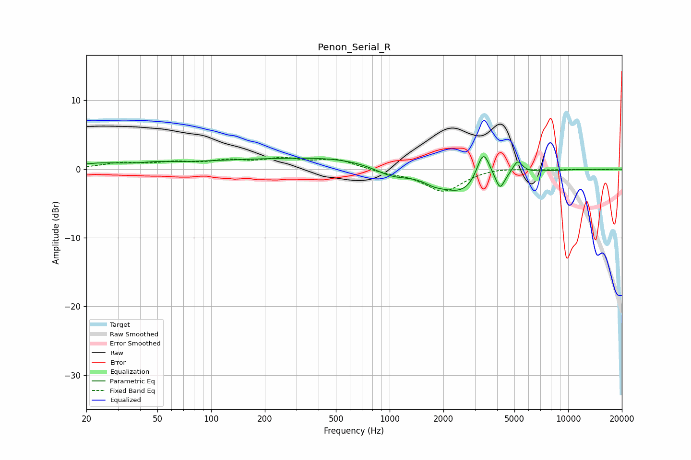

# Penon_Serial_R
See [usage instructions](https://github.com/jaakkopasanen/AutoEq#usage) for more options and info.

### Parametric EQs
Apply preamp of -1.9 dB when using parametric equalizer.

|   # | Type    |   Fc (Hz) |    Q |   Gain (dB) |
|-----|---------|-----------|------|-------------|
|   1 | Peaking |        24 | 1.12 |         0.6 |
|   2 | Peaking |        49 | 1.66 |         0.3 |
|   3 | Peaking |       232 | 0.25 |         1.4 |
|   4 | Peaking |       523 | 0.63 |         0.5 |
|   5 | Peaking |      1030 | 1.46 |        -1.3 |
|   6 | Peaking |      1778 | 2.43 |        -0.7 |
|   7 | Peaking |      2604 | 1.04 |        -3.7 |
|   8 | Peaking |      3343 | 3.72 |         4.8 |
|   9 | Peaking |      4153 | 5.92 |        -2.3 |
|  10 | Peaking |      5211 | 5.19 |         1.9 |

### Fixed Band EQs
When using fixed band (also called graphic) equalizer, apply preamp of **-1.8 dB** (if available) and set gains manually with these parameters.

|   # | Type    |   Fc (Hz) |    Q |   Gain (dB) |
|-----|---------|-----------|------|-------------|
|   1 | Peaking |        31 | 1.41 |         0.8 |
|   2 | Peaking |        62 | 1.41 |         0.8 |
|   3 | Peaking |       125 | 1.41 |         1   |
|   4 | Peaking |       250 | 1.41 |         1.3 |
|   5 | Peaking |       500 | 1.41 |         1.3 |
|   6 | Peaking |      1000 | 1.41 |        -0.5 |
|   7 | Peaking |      2000 | 1.41 |        -3.2 |
|   8 | Peaking |      4000 | 1.41 |         0.3 |
|   9 | Peaking |      8000 | 1.41 |        -0.1 |
|  10 | Peaking |     16000 | 1.41 |        -0.1 |

### Graphs

