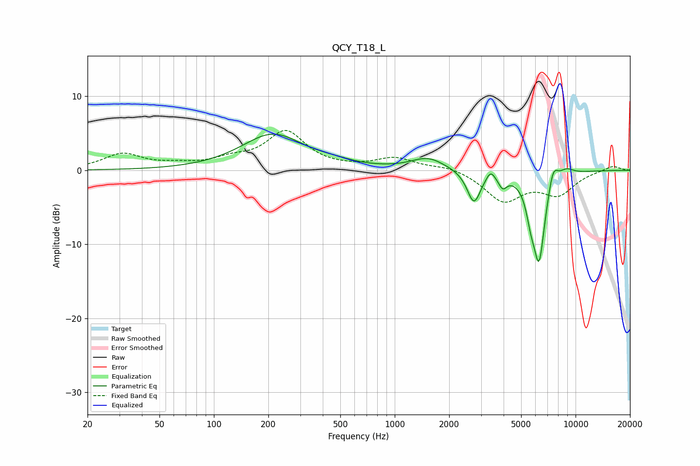

# QCY_T18_L
See [usage instructions](https://github.com/jaakkopasanen/AutoEq#usage) for more options and info.

### Parametric EQs
Apply preamp of -5.0 dB when using parametric equalizer.

|   # | Type    |   Fc (Hz) |    Q |   Gain (dB) |
|-----|---------|-----------|------|-------------|
|   1 | Peaking |       212 | 0.83 |         4.8 |
|   2 | Peaking |       467 | 1.41 |         0.4 |
|   3 | Peaking |      1527 | 1.54 |         1.6 |
|   4 | Peaking |      2741 | 3.84 |        -4.4 |
|   5 | Peaking |      3390 | 6    |         1.3 |
|   6 | Peaking |      3951 | 6    |        -1.6 |
|   7 | Peaking |      5648 | 6    |        -2.5 |
|   8 | Peaking |      6280 | 3.89 |       -12.1 |
|   9 | Peaking |      7506 | 4.87 |         2.9 |
|  10 | Peaking |      8891 | 3.33 |         0.9 |

### Fixed Band EQs
When using fixed band (also called graphic) equalizer, apply preamp of **-5.5 dB** (if available) and set gains manually with these parameters.

|   # | Type    |   Fc (Hz) |    Q |   Gain (dB) |
|-----|---------|-----------|------|-------------|
|   1 | Peaking |        31 | 1.41 |         2.1 |
|   2 | Peaking |        62 | 1.41 |         0.5 |
|   3 | Peaking |       125 | 1.41 |         1.2 |
|   4 | Peaking |       250 | 1.41 |         5.1 |
|   5 | Peaking |       500 | 1.41 |         0.1 |
|   6 | Peaking |      1000 | 1.41 |         1.6 |
|   7 | Peaking |      2000 | 1.41 |         0.6 |
|   8 | Peaking |      4000 | 1.41 |        -4   |
|   9 | Peaking |      8000 | 1.41 |        -3   |
|  10 | Peaking |     16000 | 1.41 |         0.7 |

### Graphs

