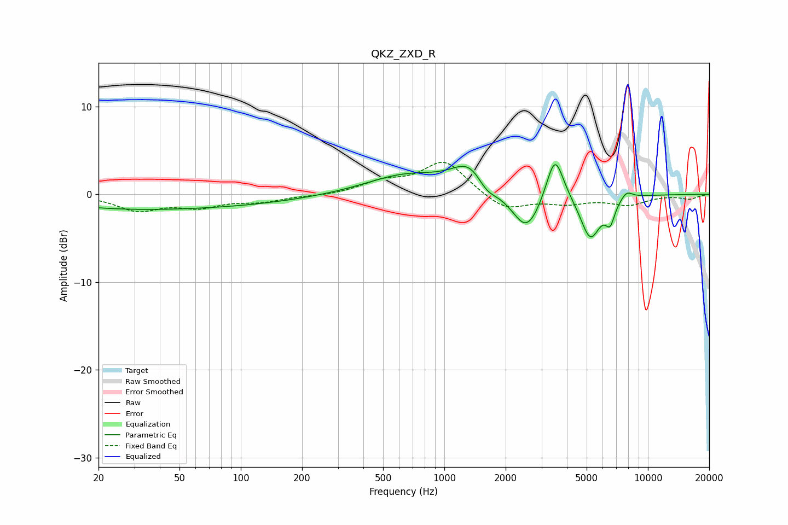

# QKZ_ZXD_R
See [usage instructions](https://github.com/jaakkopasanen/AutoEq#usage) for more options and info.

### Parametric EQs
Apply preamp of -3.5 dB when using parametric equalizer.

|   # | Type    |   Fc (Hz) |    Q |   Gain (dB) |
|-----|---------|-----------|------|-------------|
|   1 | Peaking |        22 | 0.42 |        -1.2 |
|   2 | Peaking |        86 | 0.38 |        -1.1 |
|   3 | Peaking |       643 | 0.73 |         2.1 |
|   4 | Peaking |      1352 | 1.58 |         3.4 |
|   5 | Peaking |      1605 | 2.7  |        -1.7 |
|   6 | Peaking |      2536 | 1.97 |        -4.6 |
|   7 | Peaking |      3492 | 3.3  |         5.5 |
|   8 | Peaking |      5216 | 2.84 |        -5   |
|   9 | Peaking |      6523 | 5.91 |        -2.3 |
|  10 | Peaking |      7861 | 4.46 |         0.9 |

### Fixed Band EQs
When using fixed band (also called graphic) equalizer, apply preamp of **-3.7 dB** (if available) and set gains manually with these parameters.

|   # | Type    |   Fc (Hz) |    Q |   Gain (dB) |
|-----|---------|-----------|------|-------------|
|   1 | Peaking |        31 | 1.41 |        -1.7 |
|   2 | Peaking |        62 | 1.41 |        -1.3 |
|   3 | Peaking |       125 | 1.41 |        -0.7 |
|   4 | Peaking |       250 | 1.41 |        -0.2 |
|   5 | Peaking |       500 | 1.41 |         1.3 |
|   6 | Peaking |      1000 | 1.41 |         3.8 |
|   7 | Peaking |      2000 | 1.41 |        -1.9 |
|   8 | Peaking |      4000 | 1.41 |        -0.9 |
|   9 | Peaking |      8000 | 1.41 |        -1.1 |
|  10 | Peaking |     16000 | 1.41 |        -0.5 |

### Graphs

