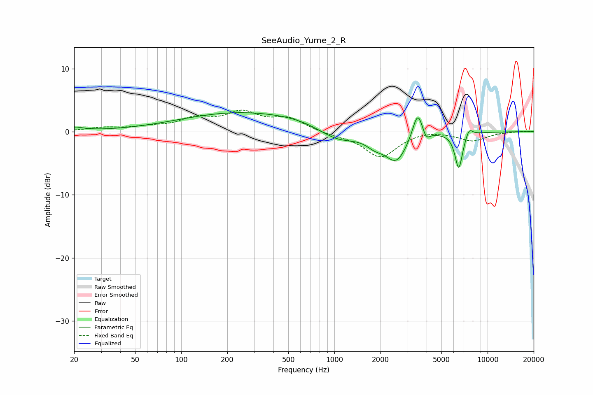

# SeeAudio_Yume_2_R
See [usage instructions](https://github.com/jaakkopasanen/AutoEq#usage) for more options and info.

### Parametric EQs
Apply preamp of -3.1 dB when using parametric equalizer.

|   # | Type    |   Fc (Hz) |    Q |   Gain (dB) |
|-----|---------|-----------|------|-------------|
|   1 | Peaking |        20 | 2.58 |         0.6 |
|   2 | Peaking |       247 | 0.35 |         3   |
|   3 | Peaking |       594 | 0.92 |         0.4 |
|   4 | Peaking |      1051 | 1.12 |        -1.9 |
|   5 | Peaking |      1835 | 2.45 |        -1.3 |
|   6 | Peaking |      2536 | 1.94 |        -4.5 |
|   7 | Peaking |      3500 | 4.2  |         4.5 |
|   8 | Peaking |      3965 | 6    |        -1.4 |
|   9 | Peaking |      6484 | 5.46 |        -5.8 |
|  10 | Peaking |      7581 | 5.85 |         1.3 |

### Fixed Band EQs
When using fixed band (also called graphic) equalizer, apply preamp of **-3.5 dB** (if available) and set gains manually with these parameters.

|   # | Type    |   Fc (Hz) |    Q |   Gain (dB) |
|-----|---------|-----------|------|-------------|
|   1 | Peaking |        31 | 1.41 |         0.5 |
|   2 | Peaking |        62 | 1.41 |         0.6 |
|   3 | Peaking |       125 | 1.41 |         1.8 |
|   4 | Peaking |       250 | 1.41 |         2.7 |
|   5 | Peaking |       500 | 1.41 |         1.9 |
|   6 | Peaking |      1000 | 1.41 |        -0.4 |
|   7 | Peaking |      2000 | 1.41 |        -4   |
|   8 | Peaking |      4000 | 1.41 |         0.4 |
|   9 | Peaking |      8000 | 1.41 |        -1.4 |
|  10 | Peaking |     16000 | 1.41 |         0.1 |

### Graphs

