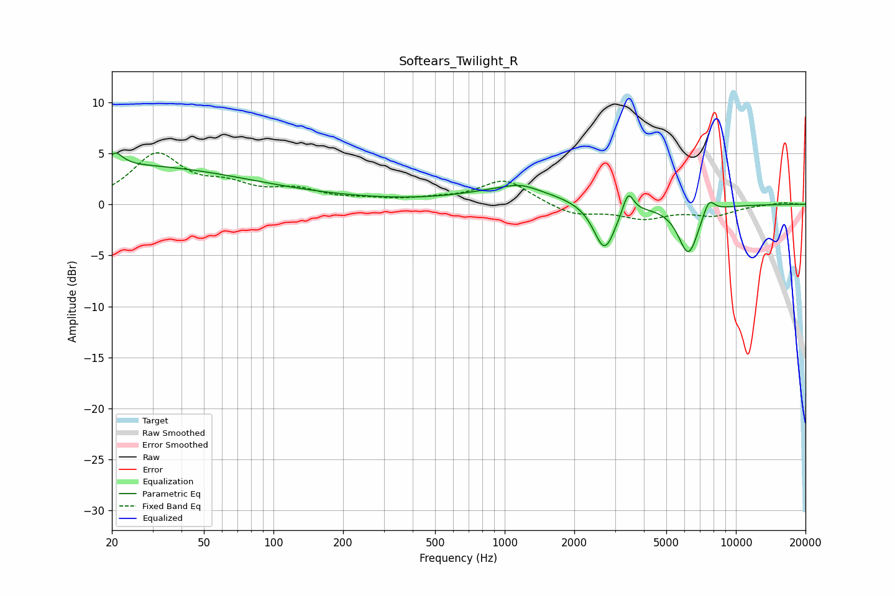

# Softears_Twilight_R
See [usage instructions](https://github.com/jaakkopasanen/AutoEq#usage) for more options and info.

### Parametric EQs
Apply preamp of -5.1 dB when using parametric equalizer.

|   # | Type    |   Fc (Hz) |    Q |   Gain (dB) |
|-----|---------|-----------|------|-------------|
|   1 | Peaking |        20 | 0.25 |         3.1 |
|   2 | Peaking |        21 | 5.49 |         3.4 |
|   3 | Peaking |        21 | 6    |        -2.2 |
|   4 | Peaking |        45 | 0.18 |         0.8 |
|   5 | Peaking |      1096 | 0.71 |         1.5 |
|   6 | Peaking |      1172 | 2.19 |         0.5 |
|   7 | Peaking |      2703 | 3.04 |        -4.7 |
|   8 | Peaking |      3419 | 6    |         2.2 |
|   9 | Peaking |      6235 | 3.07 |        -4.9 |
|  10 | Peaking |      7636 | 5.05 |         1.6 |

### Fixed Band EQs
When using fixed band (also called graphic) equalizer, apply preamp of **-5.1 dB** (if available) and set gains manually with these parameters.

|   # | Type    |   Fc (Hz) |    Q |   Gain (dB) |
|-----|---------|-----------|------|-------------|
|   1 | Peaking |        31 | 1.41 |         4.7 |
|   2 | Peaking |        62 | 1.41 |         1.5 |
|   3 | Peaking |       125 | 1.41 |         1.2 |
|   4 | Peaking |       250 | 1.41 |         0.3 |
|   5 | Peaking |       500 | 1.41 |         0.4 |
|   6 | Peaking |      1000 | 1.41 |         2.4 |
|   7 | Peaking |      2000 | 1.41 |        -1.1 |
|   8 | Peaking |      4000 | 1.41 |        -1.3 |
|   9 | Peaking |      8000 | 1.41 |        -1   |
|  10 | Peaking |     16000 | 1.41 |         0.2 |

### Graphs

