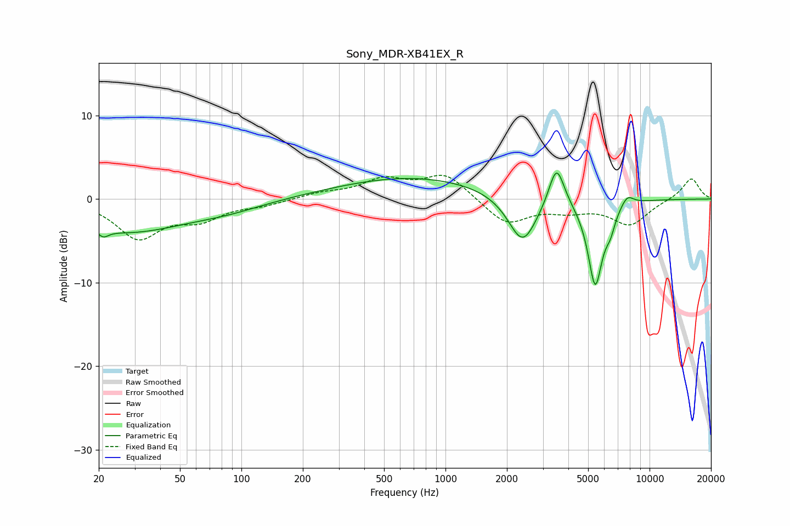

# Sony_MDR-XB41EX_R
See [usage instructions](https://github.com/jaakkopasanen/AutoEq#usage) for more options and info.

### Parametric EQs
Apply preamp of -3.2 dB when using parametric equalizer.

|   # | Type    |   Fc (Hz) |    Q |   Gain (dB) |
|-----|---------|-----------|------|-------------|
|   1 | Peaking |        21 | 5.83 |        -4.1 |
|   2 | Peaking |        21 | 5.89 |         3.2 |
|   3 | Peaking |        27 | 0.48 |        -3.8 |
|   4 | Peaking |        86 | 0.78 |        -0.8 |
|   5 | Peaking |       696 | 0.38 |         2.6 |
|   6 | Peaking |      2387 | 1.99 |        -5.9 |
|   7 | Peaking |      3501 | 3.7  |         5.1 |
|   8 | Peaking |      5417 | 3.77 |       -10.3 |
|   9 | Peaking |      6423 | 5.81 |        -1.8 |
|  10 | Peaking |      7775 | 4.27 |         1.3 |

### Fixed Band EQs
When using fixed band (also called graphic) equalizer, apply preamp of **-2.9 dB** (if available) and set gains manually with these parameters.

|   # | Type    |   Fc (Hz) |    Q |   Gain (dB) |
|-----|---------|-----------|------|-------------|
|   1 | Peaking |        31 | 1.41 |        -4.5 |
|   2 | Peaking |        62 | 1.41 |        -2.1 |
|   3 | Peaking |       125 | 1.41 |        -0.6 |
|   4 | Peaking |       250 | 1.41 |         0.6 |
|   5 | Peaking |       500 | 1.41 |         2.2 |
|   6 | Peaking |      1000 | 1.41 |         3   |
|   7 | Peaking |      2000 | 1.41 |        -3   |
|   8 | Peaking |      4000 | 1.41 |        -1.1 |
|   9 | Peaking |      8000 | 1.41 |        -3   |
|  10 | Peaking |     16000 | 1.41 |         2.6 |

### Graphs

