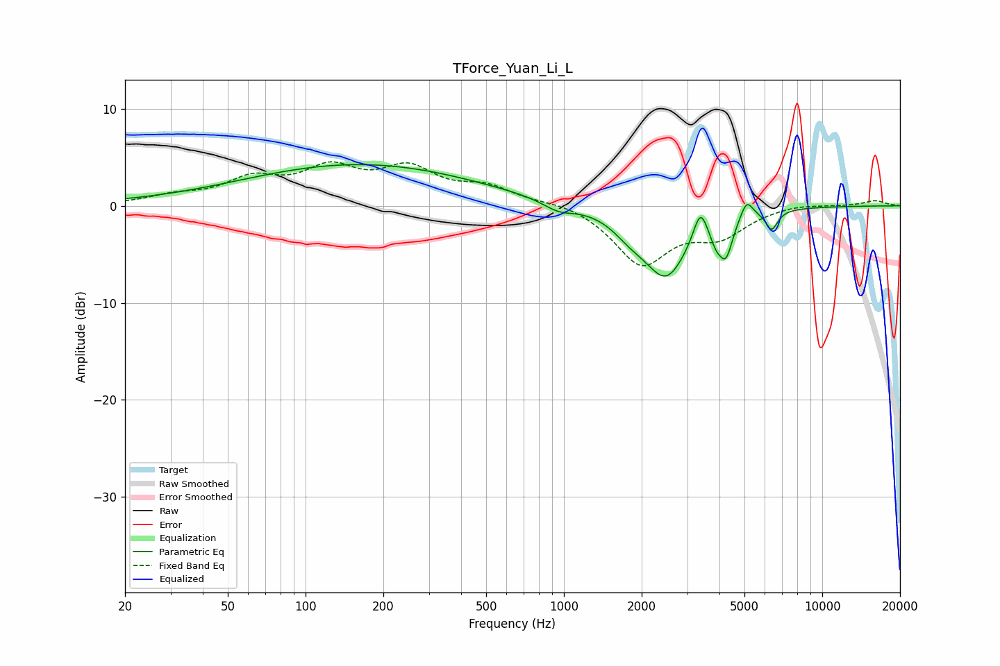

# TForce_Yuan_Li_L
See [usage instructions](https://github.com/jaakkopasanen/AutoEq#usage) for more options and info.

### Parametric EQs
Apply preamp of -4.3 dB when using parametric equalizer.

|   # | Type    |   Fc (Hz) |    Q |   Gain (dB) |
|-----|---------|-----------|------|-------------|
|   1 | Peaking |        32 | 0.4  |         0.2 |
|   2 | Peaking |       165 | 0.32 |         4.2 |
|   3 | Peaking |       953 | 2.36 |        -0.9 |
|   4 | Peaking |      1809 | 2.1  |        -1.4 |
|   5 | Peaking |      2490 | 1.62 |        -7   |
|   6 | Peaking |      3374 | 5.36 |         3.1 |
|   7 | Peaking |      3882 | 6    |        -1.7 |
|   8 | Peaking |      4241 | 5.43 |        -3.6 |
|   9 | Peaking |      5101 | 5.97 |         1.9 |
|  10 | Peaking |      6375 | 6    |        -2   |

### Fixed Band EQs
When using fixed band (also called graphic) equalizer, apply preamp of **-4.6 dB** (if available) and set gains manually with these parameters.

|   # | Type    |   Fc (Hz) |    Q |   Gain (dB) |
|-----|---------|-----------|------|-------------|
|   1 | Peaking |        31 | 1.41 |         0.8 |
|   2 | Peaking |        62 | 1.41 |         2.4 |
|   3 | Peaking |       125 | 1.41 |         3.4 |
|   4 | Peaking |       250 | 1.41 |         3.4 |
|   5 | Peaking |       500 | 1.41 |         1.7 |
|   6 | Peaking |      1000 | 1.41 |         0.5 |
|   7 | Peaking |      2000 | 1.41 |        -5.9 |
|   8 | Peaking |      4000 | 1.41 |        -2.7 |
|   9 | Peaking |      8000 | 1.41 |         0.3 |
|  10 | Peaking |     16000 | 1.41 |         0.5 |

### Graphs

