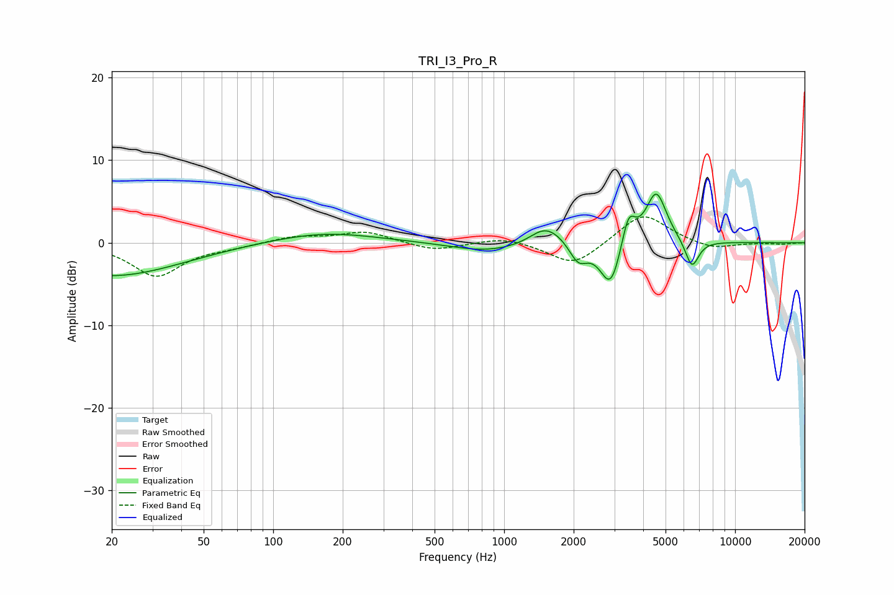

# TRI_I3_Pro_R
See [usage instructions](https://github.com/jaakkopasanen/AutoEq#usage) for more options and info.

### Parametric EQs
Apply preamp of -6.0 dB when using parametric equalizer.

|   # | Type    |   Fc (Hz) |    Q |   Gain (dB) |
|-----|---------|-----------|------|-------------|
|   1 | Peaking |        20 | 0.47 |        -4   |
|   2 | Peaking |       166 | 0.62 |         1.3 |
|   3 | Peaking |       838 | 0.93 |        -1.1 |
|   4 | Peaking |      1471 | 2.28 |         1.6 |
|   5 | Peaking |      1664 | 2.21 |         1   |
|   6 | Peaking |      2096 | 3.64 |        -2.3 |
|   7 | Peaking |      2894 | 3.13 |        -5.7 |
|   8 | Peaking |      3454 | 4.8  |         4   |
|   9 | Peaking |      4557 | 3.08 |         6.3 |
|  10 | Peaking |      6504 | 4.63 |        -3.4 |

### Fixed Band EQs
When using fixed band (also called graphic) equalizer, apply preamp of **-3.2 dB** (if available) and set gains manually with these parameters.

|   # | Type    |   Fc (Hz) |    Q |   Gain (dB) |
|-----|---------|-----------|------|-------------|
|   1 | Peaking |        31 | 1.41 |        -4   |
|   2 | Peaking |        62 | 1.41 |        -0.4 |
|   3 | Peaking |       125 | 1.41 |         0.8 |
|   4 | Peaking |       250 | 1.41 |         1.3 |
|   5 | Peaking |       500 | 1.41 |        -1   |
|   6 | Peaking |      1000 | 1.41 |         0.8 |
|   7 | Peaking |      2000 | 1.41 |        -2.9 |
|   8 | Peaking |      4000 | 1.41 |         3.7 |
|   9 | Peaking |      8000 | 1.41 |        -0.9 |
|  10 | Peaking |     16000 | 1.41 |        -0.2 |

### Graphs

