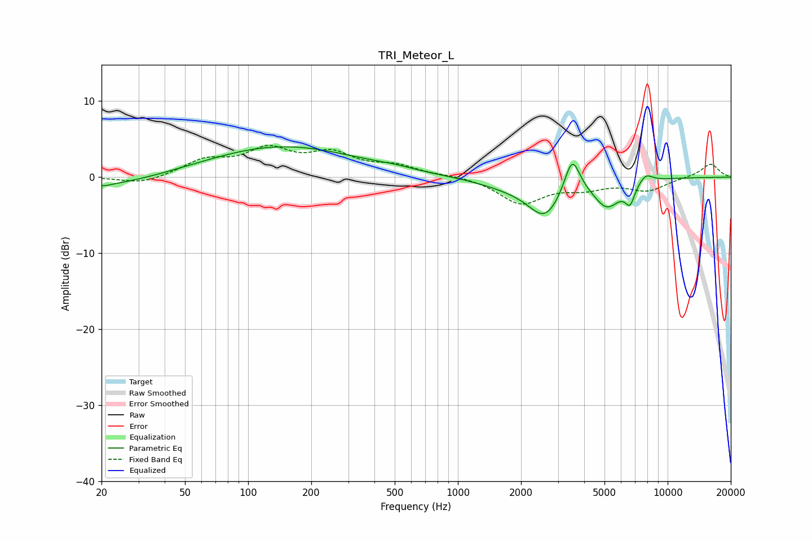

# TRI_Meteor_L
See [usage instructions](https://github.com/jaakkopasanen/AutoEq#usage) for more options and info.

### Parametric EQs
Apply preamp of -4.1 dB when using parametric equalizer.

|   # | Type    |   Fc (Hz) |    Q |   Gain (dB) |
|-----|---------|-----------|------|-------------|
|   1 | Peaking |        20 | 0.56 |        -1.4 |
|   2 | Peaking |        21 | 5.42 |        -0.2 |
|   3 | Peaking |       145 | 0.4  |         4.1 |
|   4 | Peaking |       503 | 1.59 |         0.3 |
|   5 | Peaking |      1826 | 0.87 |        -1.1 |
|   6 | Peaking |      2609 | 1.78 |        -4.5 |
|   7 | Peaking |      3505 | 3.77 |         4.9 |
|   8 | Peaking |      5142 | 2.19 |        -3.5 |
|   9 | Peaking |      6617 | 5.86 |        -2.4 |
|  10 | Peaking |      7848 | 3.99 |         1.2 |

### Fixed Band EQs
When using fixed band (also called graphic) equalizer, apply preamp of **-4.3 dB** (if available) and set gains manually with these parameters.

|   # | Type    |   Fc (Hz) |    Q |   Gain (dB) |
|-----|---------|-----------|------|-------------|
|   1 | Peaking |        31 | 1.41 |        -1   |
|   2 | Peaking |        62 | 1.41 |         2   |
|   3 | Peaking |       125 | 1.41 |         3.3 |
|   4 | Peaking |       250 | 1.41 |         2.7 |
|   5 | Peaking |       500 | 1.41 |         1.3 |
|   6 | Peaking |      1000 | 1.41 |         0.2 |
|   7 | Peaking |      2000 | 1.41 |        -3.4 |
|   8 | Peaking |      4000 | 1.41 |        -1.2 |
|   9 | Peaking |      8000 | 1.41 |        -1.7 |
|  10 | Peaking |     16000 | 1.41 |         1.8 |

### Graphs

