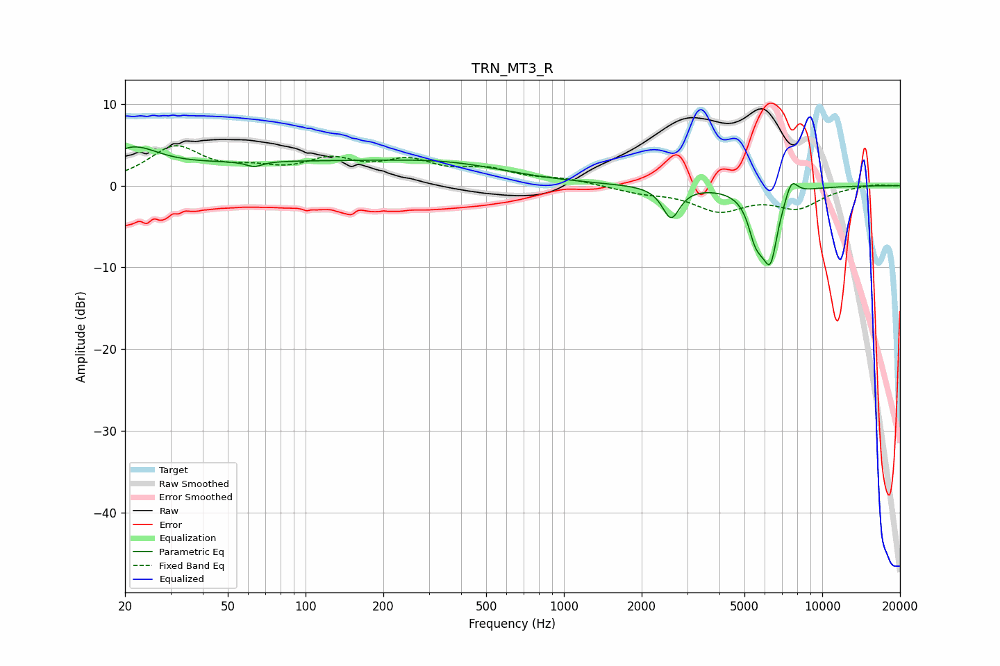

# TRN_MT3_R
See [usage instructions](https://github.com/jaakkopasanen/AutoEq#usage) for more options and info.

### Parametric EQs
Apply preamp of -4.8 dB when using parametric equalizer.

|   # | Type    |   Fc (Hz) |    Q |   Gain (dB) |
|-----|---------|-----------|------|-------------|
|   1 | Peaking |        21 | 1.42 |         3.2 |
|   2 | Peaking |        63 | 4.56 |        -0.7 |
|   3 | Peaking |        92 | 0.22 |         2.8 |
|   4 | Peaking |       384 | 0.63 |         1.2 |
|   5 | Peaking |      2599 | 4.26 |        -3.9 |
|   6 | Peaking |      5443 | 5.86 |        -2   |
|   7 | Peaking |      5737 | 3.83 |        -3.4 |
|   8 | Peaking |      6336 | 4.47 |        -9.4 |
|   9 | Peaking |      6430 | 4.72 |         2   |
|  10 | Peaking |      7593 | 5.52 |         2.4 |

### Fixed Band EQs
When using fixed band (also called graphic) equalizer, apply preamp of **-5.0 dB** (if available) and set gains manually with these parameters.

|   # | Type    |   Fc (Hz) |    Q |   Gain (dB) |
|-----|---------|-----------|------|-------------|
|   1 | Peaking |        31 | 1.41 |         4.5 |
|   2 | Peaking |        62 | 1.41 |         1.4 |
|   3 | Peaking |       125 | 1.41 |         2.7 |
|   4 | Peaking |       250 | 1.41 |         2.5 |
|   5 | Peaking |       500 | 1.41 |         1.7 |
|   6 | Peaking |      1000 | 1.41 |         0.7 |
|   7 | Peaking |      2000 | 1.41 |        -0.7 |
|   8 | Peaking |      4000 | 1.41 |        -2.8 |
|   9 | Peaking |      8000 | 1.41 |        -2.5 |
|  10 | Peaking |     16000 | 1.41 |         0.2 |

### Graphs

