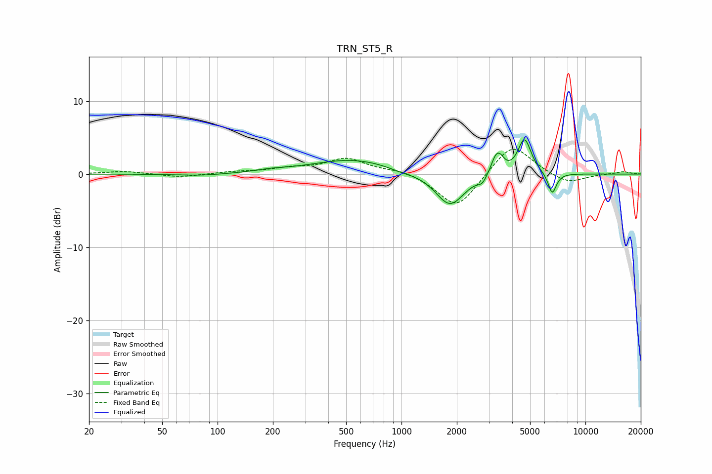

# TRN_ST5_R
See [usage instructions](https://github.com/jaakkopasanen/AutoEq#usage) for more options and info.

### Parametric EQs
Apply preamp of -4.8 dB when using parametric equalizer.

|   # | Type    |   Fc (Hz) |    Q |   Gain (dB) |
|-----|---------|-----------|------|-------------|
|   1 | Peaking |        81 | 1.08 |        -0.3 |
|   2 | Peaking |       195 | 1.71 |         0.3 |
|   3 | Peaking |       545 | 0.62 |         2   |
|   4 | Peaking |       983 | 2.17 |        -0.3 |
|   5 | Peaking |      1834 | 1.8  |        -4.5 |
|   6 | Peaking |      2751 | 5.99 |        -0.9 |
|   7 | Peaking |      3270 | 5.08 |         2.4 |
|   8 | Peaking |      3475 | 6    |         0.9 |
|   9 | Peaking |      4665 | 3.88 |         4.8 |
|  10 | Peaking |      6600 | 6    |        -2.9 |

### Fixed Band EQs
When using fixed band (also called graphic) equalizer, apply preamp of **-3.5 dB** (if available) and set gains manually with these parameters.

|   # | Type    |   Fc (Hz) |    Q |   Gain (dB) |
|-----|---------|-----------|------|-------------|
|   1 | Peaking |        31 | 1.41 |         0.4 |
|   2 | Peaking |        62 | 1.41 |        -0.5 |
|   3 | Peaking |       125 | 1.41 |         0.3 |
|   4 | Peaking |       250 | 1.41 |         0.7 |
|   5 | Peaking |       500 | 1.41 |         2.1 |
|   6 | Peaking |      1000 | 1.41 |         0.6 |
|   7 | Peaking |      2000 | 1.41 |        -4.8 |
|   8 | Peaking |      4000 | 1.41 |         4.4 |
|   9 | Peaking |      8000 | 1.41 |        -1.4 |
|  10 | Peaking |     16000 | 1.41 |         0.3 |

### Graphs

