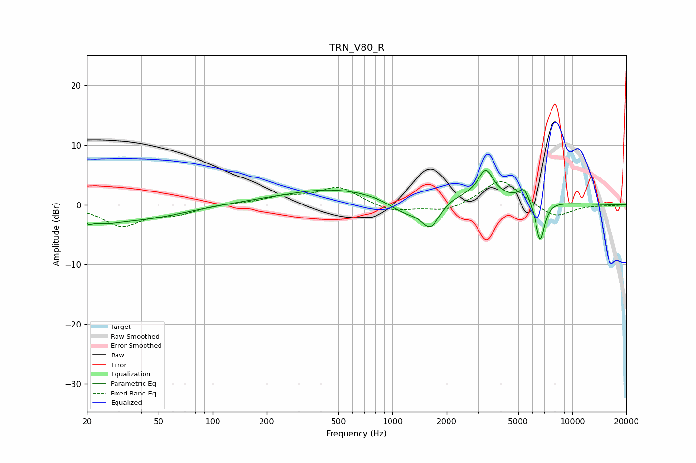

# TRN_V80_R
See [usage instructions](https://github.com/jaakkopasanen/AutoEq#usage) for more options and info.

### Parametric EQs
Apply preamp of -5.9 dB when using parametric equalizer.

|   # | Type    |   Fc (Hz) |    Q |   Gain (dB) |
|-----|---------|-----------|------|-------------|
|   1 | Peaking |        20 | 5.88 |        -1   |
|   2 | Peaking |        25 | 1.63 |        -1.3 |
|   3 | Peaking |        39 | 0.59 |        -2.3 |
|   4 | Peaking |       421 | 1.03 |         0.5 |
|   5 | Peaking |       949 | 0.21 |         2.8 |
|   6 | Peaking |      1180 | 1.29 |        -3.2 |
|   7 | Peaking |      1633 | 2.72 |        -4.6 |
|   8 | Peaking |      3303 | 3.43 |         4.4 |
|   9 | Peaking |      5386 | 4.85 |         2.1 |
|  10 | Peaking |      6626 | 5.61 |        -7   |

### Fixed Band EQs
When using fixed band (also called graphic) equalizer, apply preamp of **-4.0 dB** (if available) and set gains manually with these parameters.

|   # | Type    |   Fc (Hz) |    Q |   Gain (dB) |
|-----|---------|-----------|------|-------------|
|   1 | Peaking |        31 | 1.41 |        -3.4 |
|   2 | Peaking |        62 | 1.41 |        -1.3 |
|   3 | Peaking |       125 | 1.41 |         0.2 |
|   4 | Peaking |       250 | 1.41 |         1.2 |
|   5 | Peaking |       500 | 1.41 |         2.9 |
|   6 | Peaking |      1000 | 1.41 |        -1.2 |
|   7 | Peaking |      2000 | 1.41 |        -1.2 |
|   8 | Peaking |      4000 | 1.41 |         4.4 |
|   9 | Peaking |      8000 | 1.41 |        -2.3 |
|  10 | Peaking |     16000 | 1.41 |        -0.1 |

### Graphs

