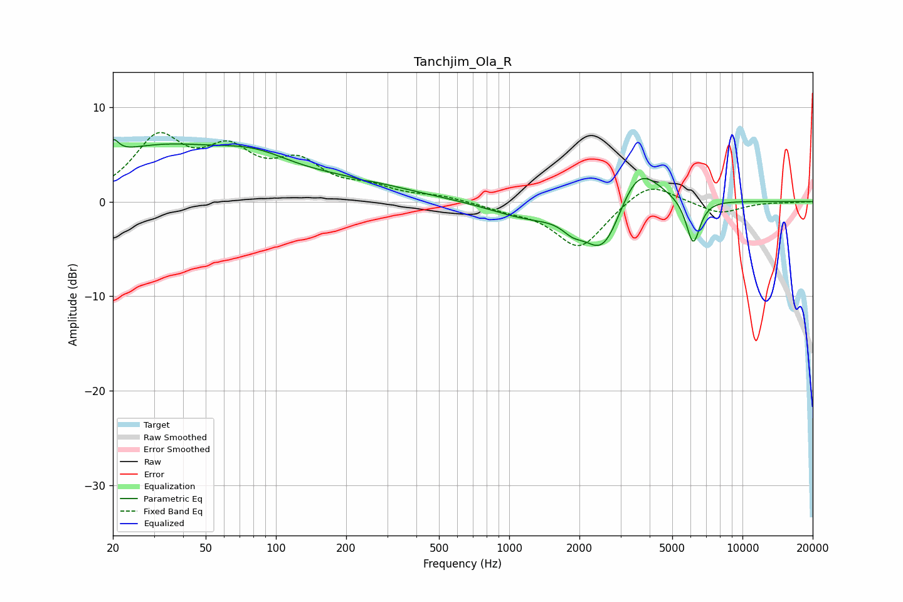

# Tanchjim_Ola_R
See [usage instructions](https://github.com/jaakkopasanen/AutoEq#usage) for more options and info.

### Parametric EQs
Apply preamp of -6.7 dB when using parametric equalizer.

|   # | Type    |   Fc (Hz) |    Q |   Gain (dB) |
|-----|---------|-----------|------|-------------|
|   1 | Peaking |        20 | 5.96 |         1.6 |
|   2 | Peaking |        30 | 0.45 |         5.3 |
|   3 | Peaking |        81 | 0.83 |         2.4 |
|   4 | Peaking |       210 | 0.54 |         1.6 |
|   5 | Peaking |       233 | 5.72 |        -0.1 |
|   6 | Peaking |      1169 | 0.91 |        -1.5 |
|   7 | Peaking |      1866 | 3.24 |        -1   |
|   8 | Peaking |      2544 | 1.62 |        -6.3 |
|   9 | Peaking |      3533 | 1.48 |         5.3 |
|  10 | Peaking |      6146 | 4.61 |        -4.8 |

### Fixed Band EQs
When using fixed band (also called graphic) equalizer, apply preamp of **-7.4 dB** (if available) and set gains manually with these parameters.

|   # | Type    |   Fc (Hz) |    Q |   Gain (dB) |
|-----|---------|-----------|------|-------------|
|   1 | Peaking |        31 | 1.41 |         6.3 |
|   2 | Peaking |        62 | 1.41 |         4.5 |
|   3 | Peaking |       125 | 1.41 |         3.6 |
|   4 | Peaking |       250 | 1.41 |         1.2 |
|   5 | Peaking |       500 | 1.41 |         0.5 |
|   6 | Peaking |      1000 | 1.41 |        -0.7 |
|   7 | Peaking |      2000 | 1.41 |        -4.9 |
|   8 | Peaking |      4000 | 1.41 |         2.3 |
|   9 | Peaking |      8000 | 1.41 |        -1.3 |
|  10 | Peaking |     16000 | 1.41 |        -0.1 |

### Graphs

