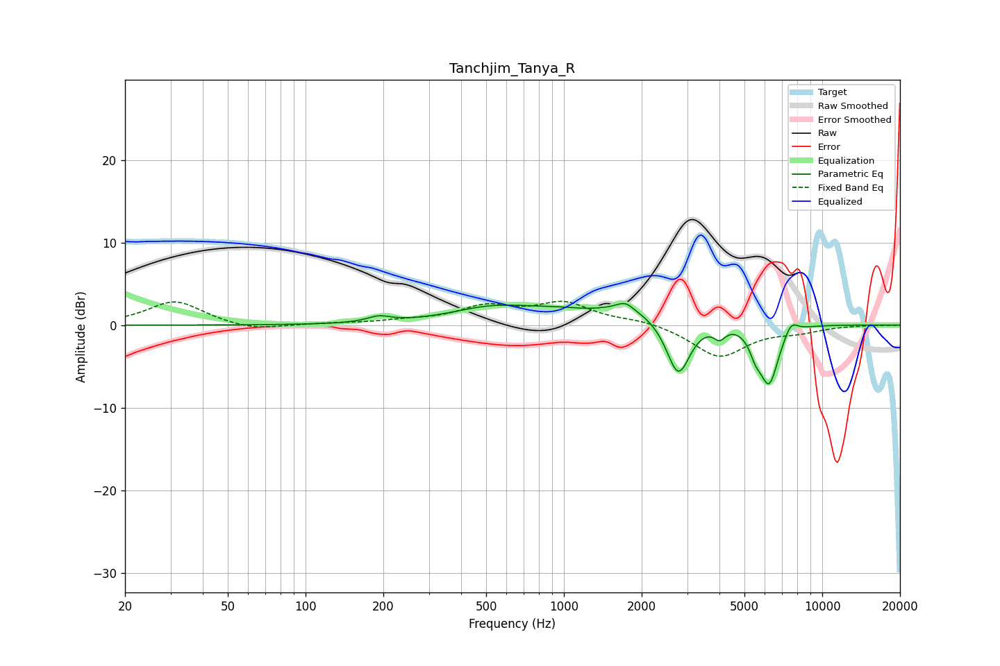

# Tanchjim_Tanya_R
See [usage instructions](https://github.com/jaakkopasanen/AutoEq#usage) for more options and info.

### Parametric EQs
Apply preamp of -2.7 dB when using parametric equalizer.

|   # | Type    |   Fc (Hz) |    Q |   Gain (dB) |
|-----|---------|-----------|------|-------------|
|   1 | Peaking |       192 | 3.12 |         0.7 |
|   2 | Peaking |       513 | 0.93 |         1.4 |
|   3 | Peaking |      1253 | 1.77 |        -0.5 |
|   4 | Peaking |      1710 | 0.44 |         2.6 |
|   5 | Peaking |      1726 | 4.48 |         0.9 |
|   6 | Peaking |      2772 | 2.9  |        -7.6 |
|   7 | Peaking |      4005 | 6    |        -1.4 |
|   8 | Peaking |      5518 | 6    |        -1.8 |
|   9 | Peaking |      6228 | 3.6  |        -7.3 |
|  10 | Peaking |      7571 | 5.16 |         1.6 |

### Fixed Band EQs
When using fixed band (also called graphic) equalizer, apply preamp of **-3.0 dB** (if available) and set gains manually with these parameters.

|   # | Type    |   Fc (Hz) |    Q |   Gain (dB) |
|-----|---------|-----------|------|-------------|
|   1 | Peaking |        31 | 1.41 |         2.9 |
|   2 | Peaking |        62 | 1.41 |        -0.7 |
|   3 | Peaking |       125 | 1.41 |         0.2 |
|   4 | Peaking |       250 | 1.41 |         0.4 |
|   5 | Peaking |       500 | 1.41 |         2   |
|   6 | Peaking |      1000 | 1.41 |         2.5 |
|   7 | Peaking |      2000 | 1.41 |         0.6 |
|   8 | Peaking |      4000 | 1.41 |        -3.9 |
|   9 | Peaking |      8000 | 1.41 |        -0.7 |
|  10 | Peaking |     16000 | 1.41 |         0   |

### Graphs

