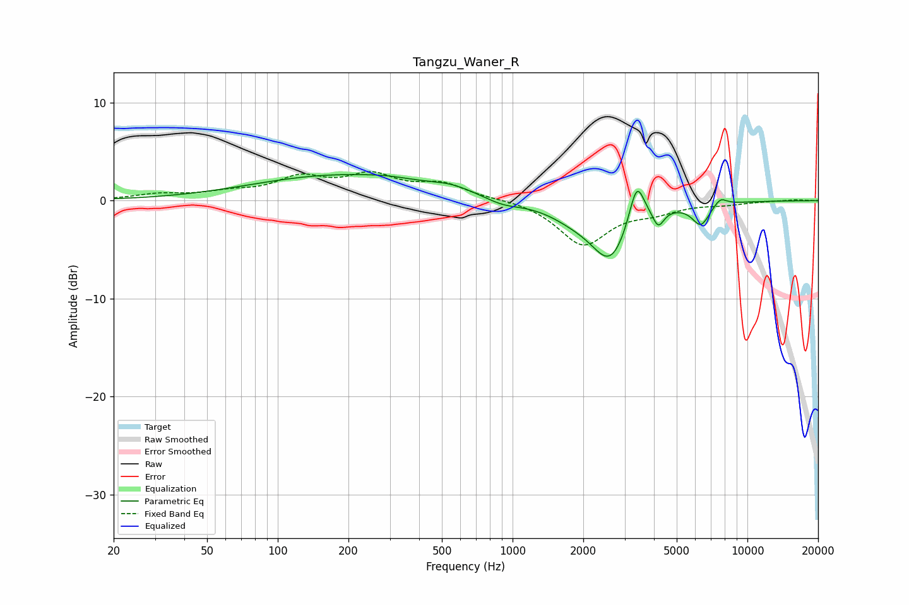

# Tangzu_Waner_R
See [usage instructions](https://github.com/jaakkopasanen/AutoEq#usage) for more options and info.

### Parametric EQs
Apply preamp of -2.8 dB when using parametric equalizer.

|   # | Type    |   Fc (Hz) |    Q |   Gain (dB) |
|-----|---------|-----------|------|-------------|
|   1 | Peaking |       188 | 0.37 |         2.6 |
|   2 | Peaking |       293 | 1.66 |         0.2 |
|   3 | Peaking |       550 | 1.6  |         0.6 |
|   4 | Peaking |       909 | 1.84 |        -0.7 |
|   5 | Peaking |      1830 | 1.25 |        -1.2 |
|   6 | Peaking |      2612 | 1.75 |        -5.6 |
|   7 | Peaking |      3378 | 4.33 |         4.4 |
|   8 | Peaking |      4172 | 5.99 |        -1.7 |
|   9 | Peaking |      6334 | 3.72 |        -2.2 |
|  10 | Peaking |      7671 | 4.92 |         0.8 |

### Fixed Band EQs
When using fixed band (also called graphic) equalizer, apply preamp of **-3.1 dB** (if available) and set gains manually with these parameters.

|   # | Type    |   Fc (Hz) |    Q |   Gain (dB) |
|-----|---------|-----------|------|-------------|
|   1 | Peaking |        31 | 1.41 |         0.6 |
|   2 | Peaking |        62 | 1.41 |         0.7 |
|   3 | Peaking |       125 | 1.41 |         2.1 |
|   4 | Peaking |       250 | 1.41 |         2.3 |
|   5 | Peaking |       500 | 1.41 |         1.5 |
|   6 | Peaking |      1000 | 1.41 |         0.2 |
|   7 | Peaking |      2000 | 1.41 |        -4.5 |
|   8 | Peaking |      4000 | 1.41 |        -0.9 |
|   9 | Peaking |      8000 | 1.41 |        -0.3 |
|  10 | Peaking |     16000 | 1.41 |         0.1 |

### Graphs

