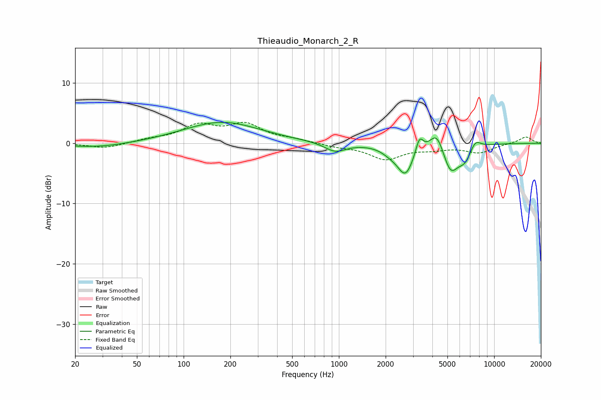

# Thieaudio_Monarch_2_R
See [usage instructions](https://github.com/jaakkopasanen/AutoEq#usage) for more options and info.

### Parametric EQs
Apply preamp of -3.6 dB when using parametric equalizer.

|   # | Type    |   Fc (Hz) |    Q |   Gain (dB) |
|-----|---------|-----------|------|-------------|
|   1 | Peaking |        28 | 0.71 |        -0.7 |
|   2 | Peaking |       176 | 0.57 |         3.5 |
|   3 | Peaking |       948 | 2.05 |        -1.5 |
|   4 | Peaking |      2136 | 2.51 |        -0.8 |
|   5 | Peaking |      2684 | 2.67 |        -4.9 |
|   6 | Peaking |      3303 | 5.97 |         2.6 |
|   7 | Peaking |      4269 | 3.24 |         3.1 |
|   8 | Peaking |      5247 | 2.79 |        -4.6 |
|   9 | Peaking |      6471 | 3.12 |        -2.3 |
|  10 | Peaking |      7564 | 4    |         1.5 |

### Fixed Band EQs
When using fixed band (also called graphic) equalizer, apply preamp of **-3.6 dB** (if available) and set gains manually with these parameters.

|   # | Type    |   Fc (Hz) |    Q |   Gain (dB) |
|-----|---------|-----------|------|-------------|
|   1 | Peaking |        31 | 1.41 |        -0.8 |
|   2 | Peaking |        62 | 1.41 |         0.5 |
|   3 | Peaking |       125 | 1.41 |         2.7 |
|   4 | Peaking |       250 | 1.41 |         2.9 |
|   5 | Peaking |       500 | 1.41 |         0.5 |
|   6 | Peaking |      1000 | 1.41 |        -0.5 |
|   7 | Peaking |      2000 | 1.41 |        -2.5 |
|   8 | Peaking |      4000 | 1.41 |        -0.8 |
|   9 | Peaking |      8000 | 1.41 |        -1.5 |
|  10 | Peaking |     16000 | 1.41 |         1.1 |

### Graphs

