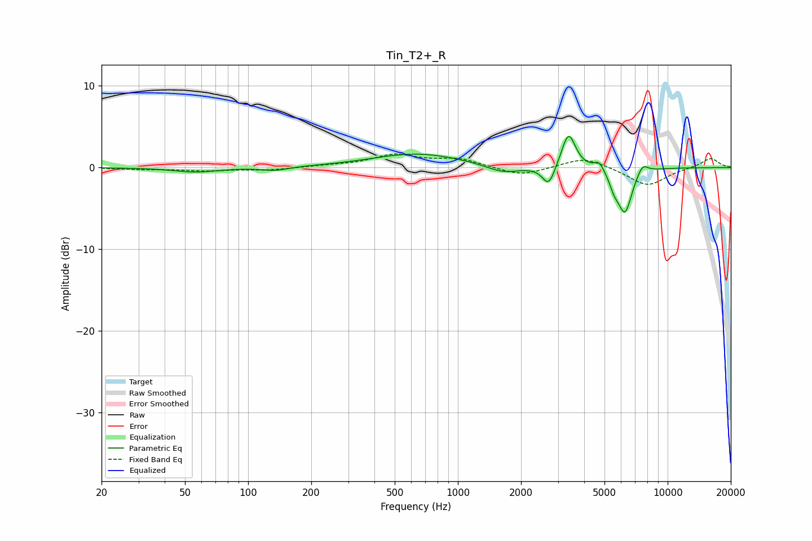

# Tin_T2+_R
See [usage instructions](https://github.com/jaakkopasanen/AutoEq#usage) for more options and info.

### Parametric EQs
Apply preamp of -3.9 dB when using parametric equalizer.

|   # | Type    |   Fc (Hz) |    Q |   Gain (dB) |
|-----|---------|-----------|------|-------------|
|   1 | Peaking |        56 | 1.35 |        -0.6 |
|   2 | Peaking |       134 | 2.29 |        -0.4 |
|   3 | Peaking |       641 | 0.66 |         1.7 |
|   4 | Peaking |      1646 | 1.75 |        -1   |
|   5 | Peaking |      2710 | 4.71 |        -2.5 |
|   6 | Peaking |      3369 | 4.3  |         4.4 |
|   7 | Peaking |      4716 | 6    |         1.1 |
|   8 | Peaking |      5559 | 5.99 |        -1.4 |
|   9 | Peaking |      6259 | 4.03 |        -5.4 |
|  10 | Peaking |      7595 | 5.21 |         1.2 |

### Fixed Band EQs
When using fixed band (also called graphic) equalizer, apply preamp of **-1.8 dB** (if available) and set gains manually with these parameters.

|   # | Type    |   Fc (Hz) |    Q |   Gain (dB) |
|-----|---------|-----------|------|-------------|
|   1 | Peaking |        31 | 1.41 |        -0.2 |
|   2 | Peaking |        62 | 1.41 |        -0.4 |
|   3 | Peaking |       125 | 1.41 |        -0.3 |
|   4 | Peaking |       250 | 1.41 |         0.2 |
|   5 | Peaking |       500 | 1.41 |         1.5 |
|   6 | Peaking |      1000 | 1.41 |         1   |
|   7 | Peaking |      2000 | 1.41 |        -1.1 |
|   8 | Peaking |      4000 | 1.41 |         1.3 |
|   9 | Peaking |      8000 | 1.41 |        -2.3 |
|  10 | Peaking |     16000 | 1.41 |         1.2 |

### Graphs

