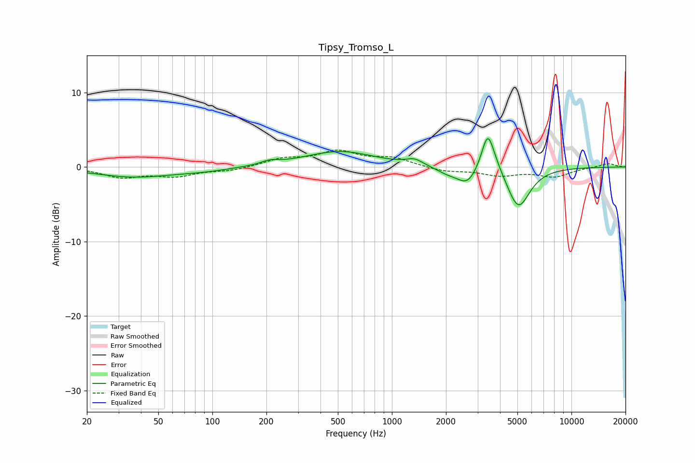

# Tipsy_Tromso_L
See [usage instructions](https://github.com/jaakkopasanen/AutoEq#usage) for more options and info.

### Parametric EQs
Apply preamp of -3.9 dB when using parametric equalizer.

|   # | Type    |   Fc (Hz) |    Q |   Gain (dB) |
|-----|---------|-----------|------|-------------|
|   1 | Peaking |        37 | 0.64 |        -1.3 |
|   2 | Peaking |        91 | 0.99 |        -0.4 |
|   3 | Peaking |       209 | 2.98 |         0.5 |
|   4 | Peaking |       512 | 0.73 |         2.1 |
|   5 | Peaking |      1338 | 2.98 |         0.8 |
|   6 | Peaking |      2044 | 2.12 |        -0.8 |
|   7 | Peaking |      2638 | 2.57 |        -2.2 |
|   8 | Peaking |      3415 | 4.25 |         4.5 |
|   9 | Peaking |      3618 | 2.4  |         1.5 |
|  10 | Peaking |      5059 | 2.2  |        -5.6 |

### Fixed Band EQs
When using fixed band (also called graphic) equalizer, apply preamp of **-2.4 dB** (if available) and set gains manually with these parameters.

|   # | Type    |   Fc (Hz) |    Q |   Gain (dB) |
|-----|---------|-----------|------|-------------|
|   1 | Peaking |        31 | 1.41 |        -1.3 |
|   2 | Peaking |        62 | 1.41 |        -1.1 |
|   3 | Peaking |       125 | 1.41 |        -0.5 |
|   4 | Peaking |       250 | 1.41 |         1   |
|   5 | Peaking |       500 | 1.41 |         1.9 |
|   6 | Peaking |      1000 | 1.41 |         1.1 |
|   7 | Peaking |      2000 | 1.41 |        -0.6 |
|   8 | Peaking |      4000 | 1.41 |        -1   |
|   9 | Peaking |      8000 | 1.41 |        -1.2 |
|  10 | Peaking |     16000 | 1.41 |         0.5 |

### Graphs

