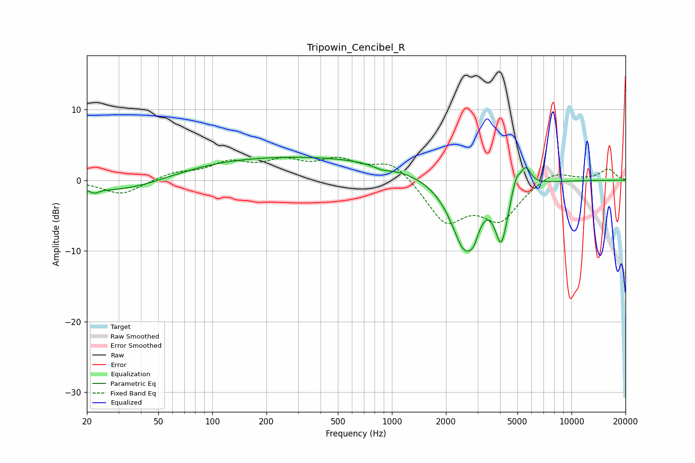

# Tripowin_Cencibel_R
See [usage instructions](https://github.com/jaakkopasanen/AutoEq#usage) for more options and info.

### Parametric EQs
Apply preamp of -3.3 dB when using parametric equalizer.

|   # | Type    |   Fc (Hz) |    Q |   Gain (dB) |
|-----|---------|-----------|------|-------------|
|   1 | Peaking |        22 | 5.54 |        -0.6 |
|   2 | Peaking |        33 | 0.54 |        -2.2 |
|   3 | Peaking |       263 | 0.19 |         3.4 |
|   4 | Peaking |       882 | 2.76 |        -0.6 |
|   5 | Peaking |      2534 | 1.81 |       -10.1 |
|   6 | Peaking |      2852 | 4.97 |        -1.9 |
|   7 | Peaking |      3391 | 1.57 |         1.3 |
|   8 | Peaking |      4065 | 3.87 |        -8   |
|   9 | Peaking |      4912 | 6    |         2.2 |
|  10 | Peaking |      5554 | 4.76 |         2.7 |

### Fixed Band EQs
When using fixed band (also called graphic) equalizer, apply preamp of **-3.3 dB** (if available) and set gains manually with these parameters.

|   # | Type    |   Fc (Hz) |    Q |   Gain (dB) |
|-----|---------|-----------|------|-------------|
|   1 | Peaking |        31 | 1.41 |        -2.1 |
|   2 | Peaking |        62 | 1.41 |         1   |
|   3 | Peaking |       125 | 1.41 |         2.2 |
|   4 | Peaking |       250 | 1.41 |         2.3 |
|   5 | Peaking |       500 | 1.41 |         2.5 |
|   6 | Peaking |      1000 | 1.41 |         2.7 |
|   7 | Peaking |      2000 | 1.41 |        -5.8 |
|   8 | Peaking |      4000 | 1.41 |        -5.3 |
|   9 | Peaking |      8000 | 1.41 |         1.5 |
|  10 | Peaking |     16000 | 1.41 |         1.6 |

### Graphs

