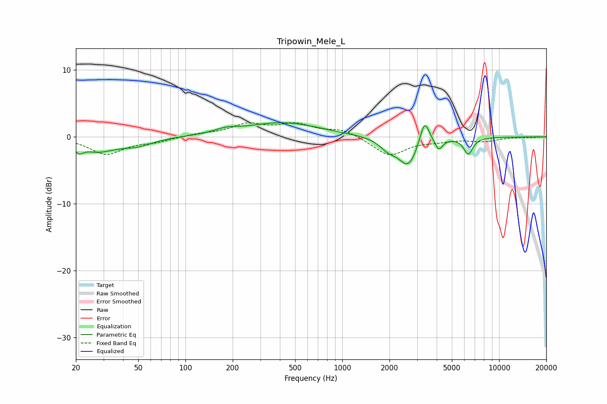

# Tripowin_Mele_L
See [usage instructions](https://github.com/jaakkopasanen/AutoEq#usage) for more options and info.

### Parametric EQs
Apply preamp of -2.2 dB when using parametric equalizer.

|   # | Type    |   Fc (Hz) |    Q |   Gain (dB) |
|-----|---------|-----------|------|-------------|
|   1 | Peaking |        21 | 5.59 |        -1.1 |
|   2 | Peaking |        27 | 1.22 |        -2   |
|   3 | Peaking |        49 | 1.42 |        -1   |
|   4 | Peaking |       182 | 1.99 |         0.6 |
|   5 | Peaking |       416 | 0.6  |         2.1 |
|   6 | Peaking |      1960 | 2.62 |        -1.4 |
|   7 | Peaking |      2633 | 2.33 |        -4.2 |
|   8 | Peaking |      3344 | 4.72 |         3.8 |
|   9 | Peaking |      4128 | 5.97 |        -1.7 |
|  10 | Peaking |      6361 | 4.86 |        -2.5 |

### Fixed Band EQs
When using fixed band (also called graphic) equalizer, apply preamp of **-2.2 dB** (if available) and set gains manually with these parameters.

|   # | Type    |   Fc (Hz) |    Q |   Gain (dB) |
|-----|---------|-----------|------|-------------|
|   1 | Peaking |        31 | 1.41 |        -2.5 |
|   2 | Peaking |        62 | 1.41 |        -0.6 |
|   3 | Peaking |       125 | 1.41 |         0.4 |
|   4 | Peaking |       250 | 1.41 |         1.7 |
|   5 | Peaking |       500 | 1.41 |         1.7 |
|   6 | Peaking |      1000 | 1.41 |         1.1 |
|   7 | Peaking |      2000 | 1.41 |        -2.8 |
|   8 | Peaking |      4000 | 1.41 |        -0.5 |
|   9 | Peaking |      8000 | 1.41 |        -0.6 |
|  10 | Peaking |     16000 | 1.41 |        -0.1 |

### Graphs

