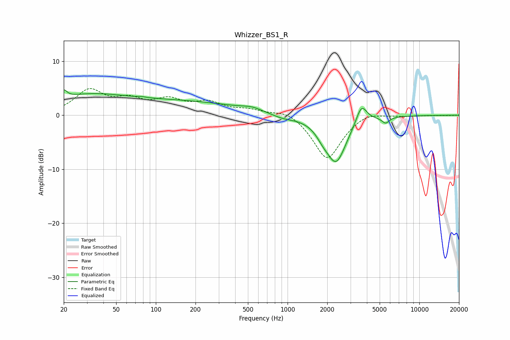

# Whizzer_BS1_R
See [usage instructions](https://github.com/jaakkopasanen/AutoEq#usage) for more options and info.

### Parametric EQs
Apply preamp of -4.8 dB when using parametric equalizer.

|   # | Type    |   Fc (Hz) |    Q |   Gain (dB) |
|-----|---------|-----------|------|-------------|
|   1 | Peaking |        20 | 5.94 |         1.5 |
|   2 | Peaking |        28 | 0.5  |         3.2 |
|   3 | Peaking |        78 | 5.98 |         0.1 |
|   4 | Peaking |       154 | 0.3  |         2.4 |
|   5 | Peaking |       534 | 1.96 |         0.6 |
|   6 | Peaking |       919 | 1.61 |        -0.7 |
|   7 | Peaking |      1846 | 3.04 |        -1.1 |
|   8 | Peaking |      2332 | 1.77 |        -8.6 |
|   9 | Peaking |      3638 | 3.42 |         3.6 |
|  10 | Peaking |      5548 | 5.05 |        -1.1 |

### Fixed Band EQs
When using fixed band (also called graphic) equalizer, apply preamp of **-5.0 dB** (if available) and set gains manually with these parameters.

|   # | Type    |   Fc (Hz) |    Q |   Gain (dB) |
|-----|---------|-----------|------|-------------|
|   1 | Peaking |        31 | 1.41 |         4.4 |
|   2 | Peaking |        62 | 1.41 |         2.3 |
|   3 | Peaking |       125 | 1.41 |         2.4 |
|   4 | Peaking |       250 | 1.41 |         2.1 |
|   5 | Peaking |       500 | 1.41 |         0.9 |
|   6 | Peaking |      1000 | 1.41 |         1.2 |
|   7 | Peaking |      2000 | 1.41 |        -8.3 |
|   8 | Peaking |      4000 | 1.41 |         1   |
|   9 | Peaking |      8000 | 1.41 |        -0.1 |
|  10 | Peaking |     16000 | 1.41 |        -0   |

### Graphs

