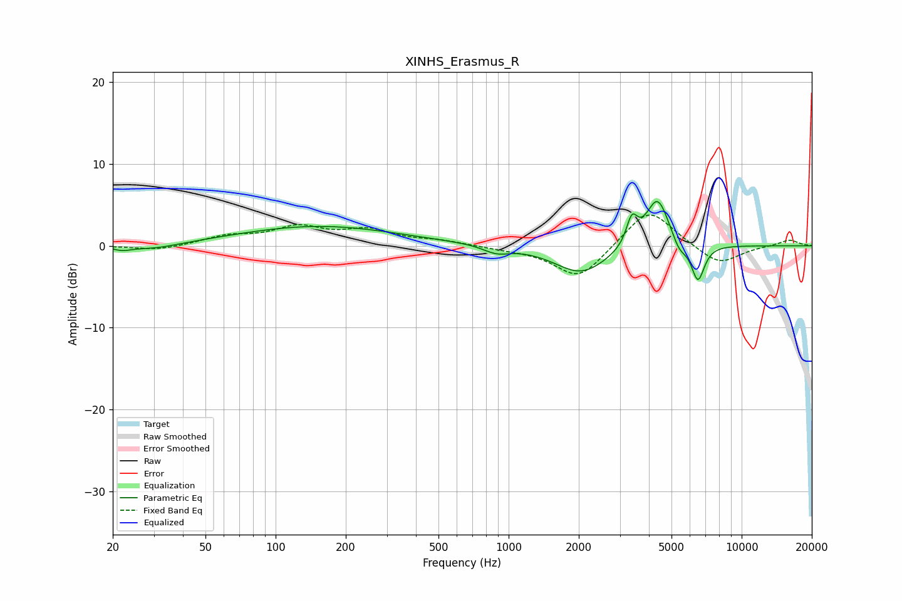

# XINHS_Erasmus_R
See [usage instructions](https://github.com/jaakkopasanen/AutoEq#usage) for more options and info.

### Parametric EQs
Apply preamp of -5.5 dB when using parametric equalizer.

|   # | Type    |   Fc (Hz) |    Q |   Gain (dB) |
|-----|---------|-----------|------|-------------|
|   1 | Peaking |        22 | 3.65 |        -0.5 |
|   2 | Peaking |        30 | 1.29 |        -0.7 |
|   3 | Peaking |       153 | 0.41 |         2.4 |
|   4 | Peaking |       886 | 2.45 |        -0.9 |
|   5 | Peaking |       947 | 0.92 |         0.1 |
|   6 | Peaking |      2048 | 1.23 |        -3.5 |
|   7 | Peaking |      3380 | 5.95 |         3.2 |
|   8 | Peaking |      4354 | 2.76 |         6.2 |
|   9 | Peaking |      5393 | 4.61 |        -1.5 |
|  10 | Peaking |      6492 | 4.91 |        -4.5 |

### Fixed Band EQs
When using fixed band (also called graphic) equalizer, apply preamp of **-3.9 dB** (if available) and set gains manually with these parameters.

|   # | Type    |   Fc (Hz) |    Q |   Gain (dB) |
|-----|---------|-----------|------|-------------|
|   1 | Peaking |        31 | 1.41 |        -0.6 |
|   2 | Peaking |        62 | 1.41 |         1.1 |
|   3 | Peaking |       125 | 1.41 |         2.1 |
|   4 | Peaking |       250 | 1.41 |         1.7 |
|   5 | Peaking |       500 | 1.41 |         0.5 |
|   6 | Peaking |      1000 | 1.41 |        -0.3 |
|   7 | Peaking |      2000 | 1.41 |        -4.1 |
|   8 | Peaking |      4000 | 1.41 |         4.8 |
|   9 | Peaking |      8000 | 1.41 |        -2.4 |
|  10 | Peaking |     16000 | 1.41 |         0.8 |

### Graphs

