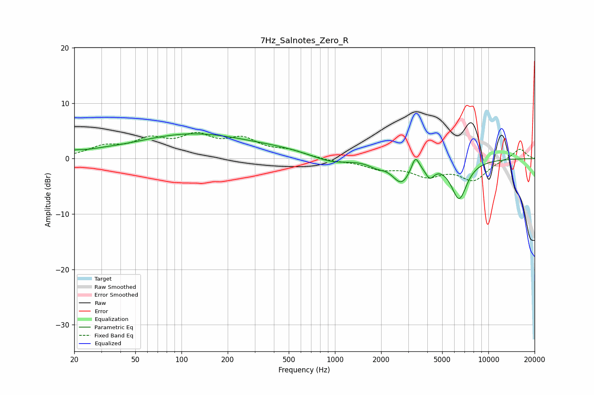

# 7Hz_Salnotes_Zero_R
See [usage instructions](https://github.com/jaakkopasanen/AutoEq#usage) for more options and info.

### Parametric EQs
Apply preamp of -4.6 dB when using parametric equalizer.

|   # | Type    |   Fc (Hz) |    Q |   Gain (dB) |
|-----|---------|-----------|------|-------------|
|   1 | Peaking |        20 | 3.02 |         0.5 |
|   2 | Peaking |        29 | 1.14 |         0.4 |
|   3 | Peaking |       118 | 0.37 |         4.4 |
|   4 | Peaking |       466 | 0.69 |         0.7 |
|   5 | Peaking |       940 | 1.21 |        -1.1 |
|   6 | Peaking |      1872 | 2.64 |        -0.9 |
|   7 | Peaking |      2709 | 2.41 |        -4   |
|   8 | Peaking |      3344 | 5.87 |         2.6 |
|   9 | Peaking |      4146 | 4.81 |        -2.2 |
|  10 | Peaking |      6442 | 2.61 |        -7   |

### Fixed Band EQs
When using fixed band (also called graphic) equalizer, apply preamp of **-4.8 dB** (if available) and set gains manually with these parameters.

|   # | Type    |   Fc (Hz) |    Q |   Gain (dB) |
|-----|---------|-----------|------|-------------|
|   1 | Peaking |        31 | 1.41 |         1.9 |
|   2 | Peaking |        62 | 1.41 |         3   |
|   3 | Peaking |       125 | 1.41 |         3.5 |
|   4 | Peaking |       250 | 1.41 |         3.1 |
|   5 | Peaking |       500 | 1.41 |         1.2 |
|   6 | Peaking |      1000 | 1.41 |        -0.4 |
|   7 | Peaking |      2000 | 1.41 |        -1.6 |
|   8 | Peaking |      4000 | 1.41 |        -2.7 |
|   9 | Peaking |      8000 | 1.41 |        -3.6 |
|  10 | Peaking |     16000 | 1.41 |         1.9 |

### Graphs

