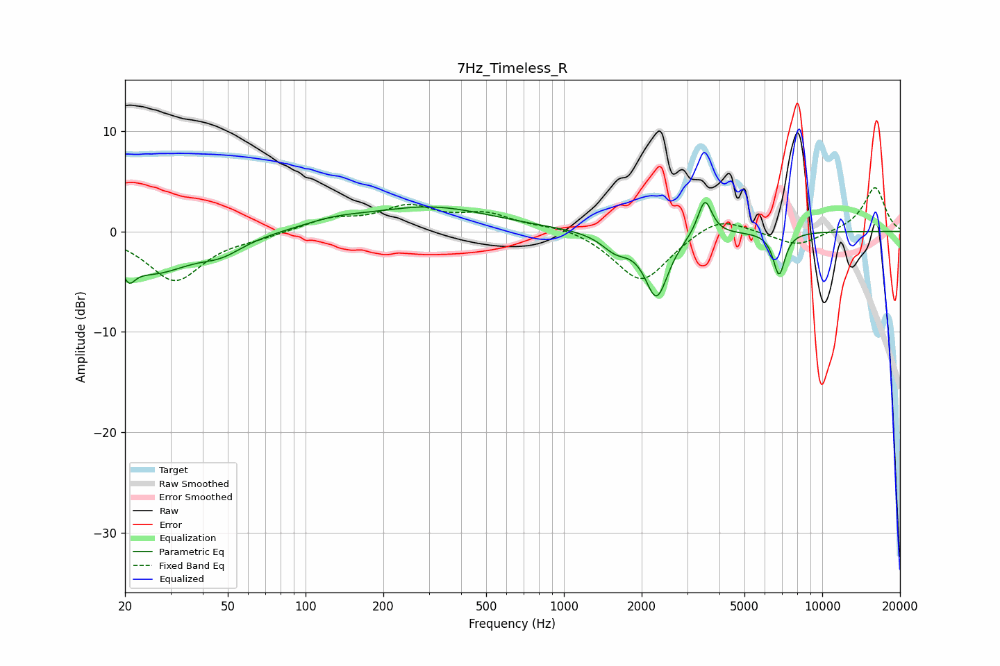

# 7Hz_Timeless_R
See [usage instructions](https://github.com/jaakkopasanen/AutoEq#usage) for more options and info.

### Parametric EQs
Apply preamp of -3.0 dB when using parametric equalizer.

|   # | Type    |   Fc (Hz) |    Q |   Gain (dB) |
|-----|---------|-----------|------|-------------|
|   1 | Peaking |        21 | 5.96 |        -4.9 |
|   2 | Peaking |        21 | 6    |         3.1 |
|   3 | Peaking |        26 | 0.94 |        -3.9 |
|   4 | Peaking |        47 | 1.67 |        -1.3 |
|   5 | Peaking |       130 | 1.13 |         0.7 |
|   6 | Peaking |       306 | 0.59 |         2.4 |
|   7 | Peaking |      1588 | 2.55 |        -1.6 |
|   8 | Peaking |      2285 | 3.13 |        -6.3 |
|   9 | Peaking |      3513 | 5.17 |         3.7 |
|  10 | Peaking |      6807 | 5.96 |        -4.3 |

### Fixed Band EQs
When using fixed band (also called graphic) equalizer, apply preamp of **-4.4 dB** (if available) and set gains manually with these parameters.

|   # | Type    |   Fc (Hz) |    Q |   Gain (dB) |
|-----|---------|-----------|------|-------------|
|   1 | Peaking |        31 | 1.41 |        -4.9 |
|   2 | Peaking |        62 | 1.41 |        -0.4 |
|   3 | Peaking |       125 | 1.41 |         1.2 |
|   4 | Peaking |       250 | 1.41 |         2.3 |
|   5 | Peaking |       500 | 1.41 |         1.5 |
|   6 | Peaking |      1000 | 1.41 |         0.6 |
|   7 | Peaking |      2000 | 1.41 |        -5.1 |
|   8 | Peaking |      4000 | 1.41 |         1.8 |
|   9 | Peaking |      8000 | 1.41 |        -1.5 |
|  10 | Peaking |     16000 | 1.41 |         4.4 |

### Graphs

