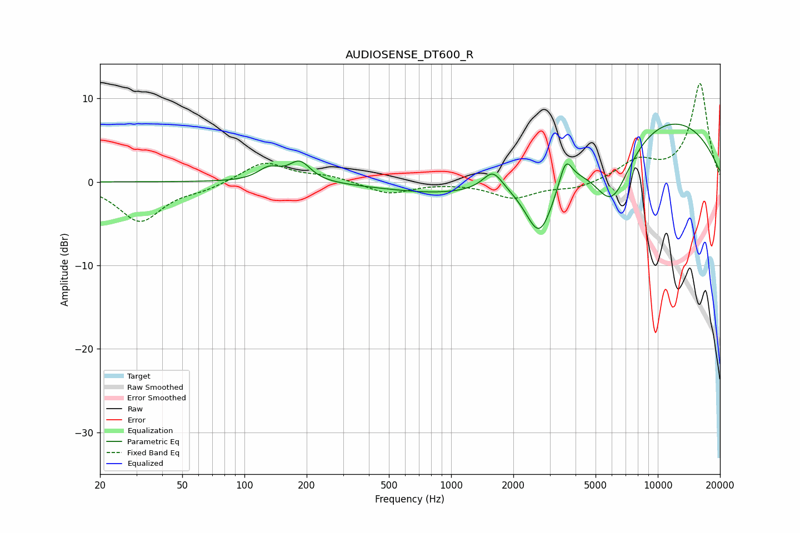

# AUDIOSENSE_DT600_R
See [usage instructions](https://github.com/jaakkopasanen/AutoEq#usage) for more options and info.

### Parametric EQs
Apply preamp of -7.0 dB when using parametric equalizer.

|   # | Type    |   Fc (Hz) |    Q |   Gain (dB) |
|-----|---------|-----------|------|-------------|
|   1 | Peaking |       131 | 2.66 |         1.5 |
|   2 | Peaking |       185 | 2.71 |         2.4 |
|   3 | Peaking |      1062 | 0.77 |        -0.2 |
|   4 | Peaking |      1590 | 3.07 |         2.2 |
|   5 | Peaking |      2136 | 0.28 |        -3.3 |
|   6 | Peaking |      2674 | 1.77 |        -6.8 |
|   7 | Peaking |      2701 | 2.75 |        -1.3 |
|   8 | Peaking |      3583 | 4.66 |         3.1 |
|   9 | Peaking |      5999 | 1.37 |        -8.5 |
|  10 | Peaking |      7620 | 0.24 |         9.7 |

### Fixed Band EQs
When using fixed band (also called graphic) equalizer, apply preamp of **-11.9 dB** (if available) and set gains manually with these parameters.

|   # | Type    |   Fc (Hz) |    Q |   Gain (dB) |
|-----|---------|-----------|------|-------------|
|   1 | Peaking |        31 | 1.41 |        -4.7 |
|   2 | Peaking |        62 | 1.41 |        -0.7 |
|   3 | Peaking |       125 | 1.41 |         2.4 |
|   4 | Peaking |       250 | 1.41 |         0.7 |
|   5 | Peaking |       500 | 1.41 |        -1.4 |
|   6 | Peaking |      1000 | 1.41 |        -0   |
|   7 | Peaking |      2000 | 1.41 |        -1.9 |
|   8 | Peaking |      4000 | 1.41 |        -0.8 |
|   9 | Peaking |      8000 | 1.41 |         2.3 |
|  10 | Peaking |     16000 | 1.41 |        11.8 |

### Graphs

