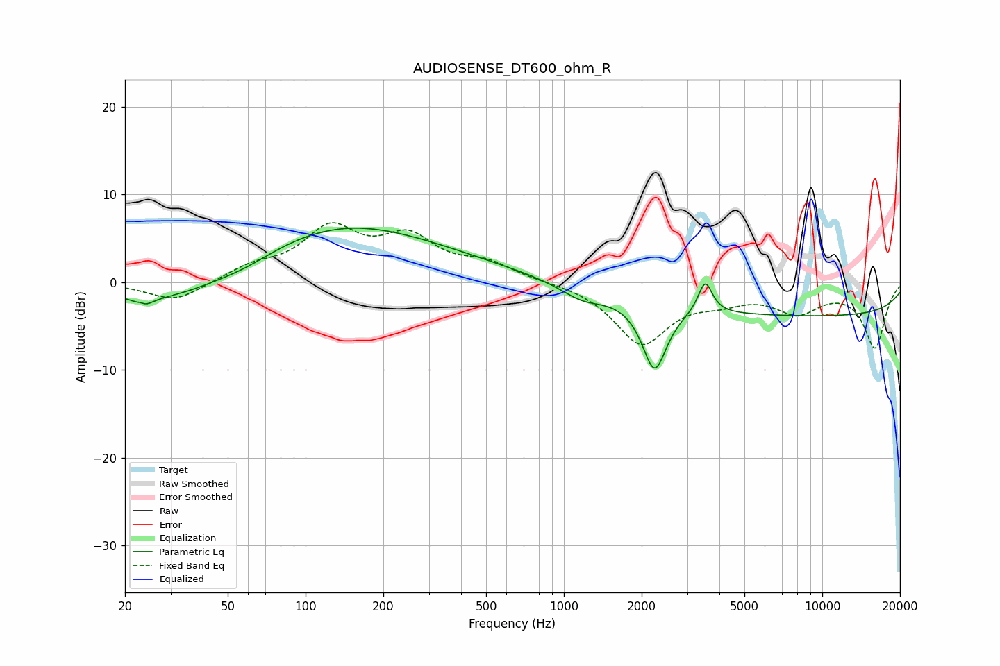

# AUDIOSENSE_DT600_ohm_R
See [usage instructions](https://github.com/jaakkopasanen/AutoEq#usage) for more options and info.

### Parametric EQs
Apply preamp of -6.3 dB when using parametric equalizer.

|   # | Type    |   Fc (Hz) |    Q |   Gain (dB) |
|-----|---------|-----------|------|-------------|
|   1 | Peaking |        23 | 5.99 |         2.5 |
|   2 | Peaking |        23 | 5.07 |        -3.2 |
|   3 | Peaking |        29 | 0.63 |        -2.8 |
|   4 | Peaking |        58 | 1.29 |        -0.7 |
|   5 | Peaking |       132 | 0.42 |         5.9 |
|   6 | Peaking |       351 | 0.46 |         1.2 |
|   7 | Peaking |      1178 | 1.66 |        -1.5 |
|   8 | Peaking |      2243 | 2.98 |        -7.8 |
|   9 | Peaking |      3525 | 5.24 |         3.7 |
|  10 | Peaking |      9498 | 0.18 |        -3.8 |

### Fixed Band EQs
When using fixed band (also called graphic) equalizer, apply preamp of **-6.9 dB** (if available) and set gains manually with these parameters.

|   # | Type    |   Fc (Hz) |    Q |   Gain (dB) |
|-----|---------|-----------|------|-------------|
|   1 | Peaking |        31 | 1.41 |        -2.3 |
|   2 | Peaking |        62 | 1.41 |         1.5 |
|   3 | Peaking |       125 | 1.41 |         5.7 |
|   4 | Peaking |       250 | 1.41 |         4.5 |
|   5 | Peaking |       500 | 1.41 |         1.9 |
|   6 | Peaking |      1000 | 1.41 |         0.1 |
|   7 | Peaking |      2000 | 1.41 |        -6.9 |
|   8 | Peaking |      4000 | 1.41 |        -1.5 |
|   9 | Peaking |      8000 | 1.41 |        -3   |
|  10 | Peaking |     16000 | 1.41 |        -7.4 |

### Graphs

