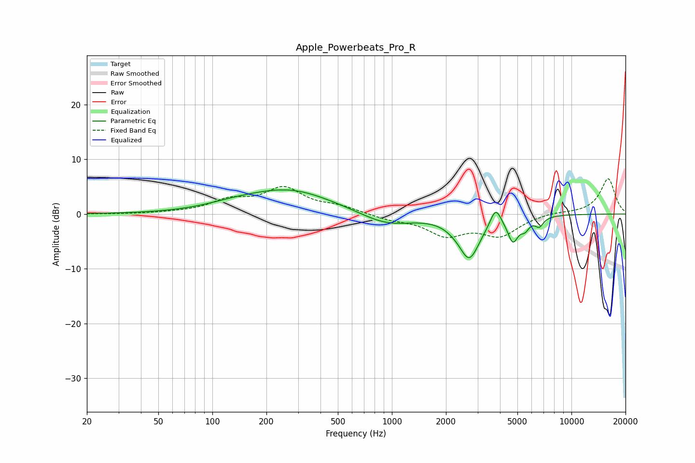

# Apple_Powerbeats_Pro_R
See [usage instructions](https://github.com/jaakkopasanen/AutoEq#usage) for more options and info.

### Parametric EQs
Apply preamp of -4.5 dB when using parametric equalizer.

|   # | Type    |   Fc (Hz) |    Q |   Gain (dB) |
|-----|---------|-----------|------|-------------|
|   1 | Peaking |       132 | 0.89 |         0.8 |
|   2 | Peaking |       270 | 0.59 |         4.3 |
|   3 | Peaking |       934 | 0.98 |        -2.3 |
|   4 | Peaking |      2193 | 3.23 |        -0.2 |
|   5 | Peaking |      2539 | 2.73 |         0.5 |
|   6 | Peaking |      2686 | 2.31 |        -8.3 |
|   7 | Peaking |      3780 | 4.7  |         3.4 |
|   8 | Peaking |      4718 | 4.81 |        -4.3 |
|   9 | Peaking |      5506 | 5.78 |        -1.7 |
|  10 | Peaking |      6617 | 5.9  |        -1.6 |

### Fixed Band EQs
When using fixed band (also called graphic) equalizer, apply preamp of **-6.5 dB** (if available) and set gains manually with these parameters.

|   # | Type    |   Fc (Hz) |    Q |   Gain (dB) |
|-----|---------|-----------|------|-------------|
|   1 | Peaking |        31 | 1.41 |        -0   |
|   2 | Peaking |        62 | 1.41 |         0.2 |
|   3 | Peaking |       125 | 1.41 |         2.2 |
|   4 | Peaking |       250 | 1.41 |         4.5 |
|   5 | Peaking |       500 | 1.41 |         1.2 |
|   6 | Peaking |      1000 | 1.41 |        -0.9 |
|   7 | Peaking |      2000 | 1.41 |        -3.6 |
|   8 | Peaking |      4000 | 1.41 |        -3.7 |
|   9 | Peaking |      8000 | 1.41 |         0.4 |
|  10 | Peaking |     16000 | 1.41 |         6.5 |

### Graphs

