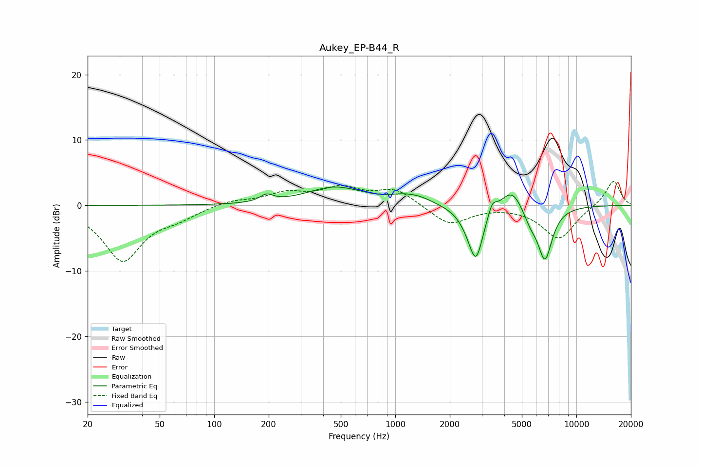

# Aukey_EP-B44_R
See [usage instructions](https://github.com/jaakkopasanen/AutoEq#usage) for more options and info.

### Parametric EQs
Apply preamp of -2.9 dB when using parametric equalizer.

|   # | Type    |   Fc (Hz) |    Q |   Gain (dB) |
|-----|---------|-----------|------|-------------|
|   1 | Peaking |       195 | 3.92 |         1.1 |
|   2 | Peaking |       464 | 0.9  |         2.7 |
|   3 | Peaking |      1129 | 1.67 |         1   |
|   4 | Peaking |      1389 | 2.05 |         0.6 |
|   5 | Peaking |      2521 | 2.57 |        -1.2 |
|   6 | Peaking |      2791 | 3.51 |        -7.6 |
|   7 | Peaking |      3430 | 6    |         1.9 |
|   8 | Peaking |      4404 | 2.36 |         3.3 |
|   9 | Peaking |      5562 | 3.54 |        -1.9 |
|  10 | Peaking |      6706 | 3.31 |        -8.1 |

### Fixed Band EQs
When using fixed band (also called graphic) equalizer, apply preamp of **-3.8 dB** (if available) and set gains manually with these parameters.

|   # | Type    |   Fc (Hz) |    Q |   Gain (dB) |
|-----|---------|-----------|------|-------------|
|   1 | Peaking |        31 | 1.41 |        -8.3 |
|   2 | Peaking |        62 | 1.41 |        -1.4 |
|   3 | Peaking |       125 | 1.41 |         0.8 |
|   4 | Peaking |       250 | 1.41 |         1.7 |
|   5 | Peaking |       500 | 1.41 |         2.4 |
|   6 | Peaking |      1000 | 1.41 |         2.4 |
|   7 | Peaking |      2000 | 1.41 |        -3   |
|   8 | Peaking |      4000 | 1.41 |         0   |
|   9 | Peaking |      8000 | 1.41 |        -5.1 |
|  10 | Peaking |     16000 | 1.41 |         3.9 |

### Graphs

