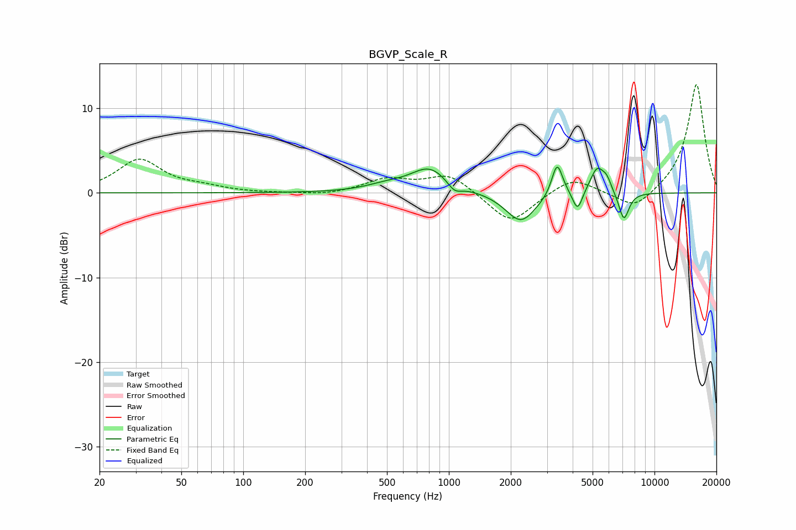

# BGVP_Scale_R
See [usage instructions](https://github.com/jaakkopasanen/AutoEq#usage) for more options and info.

### Parametric EQs
Apply preamp of -3.2 dB when using parametric equalizer.

|   # | Type    |   Fc (Hz) |    Q |   Gain (dB) |
|-----|---------|-----------|------|-------------|
|   1 | Peaking |       491 | 1.46 |         0.6 |
|   2 | Peaking |       808 | 1.5  |         2.9 |
|   3 | Peaking |      1065 | 3.95 |        -1.1 |
|   4 | Peaking |      2238 | 1.92 |        -3.5 |
|   5 | Peaking |      3356 | 5.51 |         3.5 |
|   6 | Peaking |      3435 | 4.13 |         0.5 |
|   7 | Peaking |      4225 | 6    |        -2.4 |
|   8 | Peaking |      5260 | 4.02 |         3   |
|   9 | Peaking |      5864 | 6    |         1.2 |
|  10 | Peaking |      7097 | 5.41 |        -3.4 |

### Fixed Band EQs
When using fixed band (also called graphic) equalizer, apply preamp of **-12.9 dB** (if available) and set gains manually with these parameters.

|   # | Type    |   Fc (Hz) |    Q |   Gain (dB) |
|-----|---------|-----------|------|-------------|
|   1 | Peaking |        31 | 1.41 |         3.9 |
|   2 | Peaking |        62 | 1.41 |         0.5 |
|   3 | Peaking |       125 | 1.41 |        -0   |
|   4 | Peaking |       250 | 1.41 |        -0.3 |
|   5 | Peaking |       500 | 1.41 |         1.5 |
|   6 | Peaking |      1000 | 1.41 |         2.2 |
|   7 | Peaking |      2000 | 1.41 |        -3.7 |
|   8 | Peaking |      4000 | 1.41 |         1.9 |
|   9 | Peaking |      8000 | 1.41 |        -2.2 |
|  10 | Peaking |     16000 | 1.41 |        13   |

### Graphs

