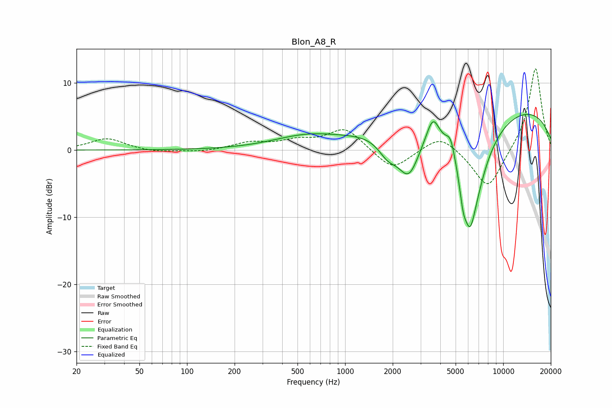

# Blon_A8_R
See [usage instructions](https://github.com/jaakkopasanen/AutoEq#usage) for more options and info.

### Parametric EQs
Apply preamp of -5.4 dB when using parametric equalizer.

|   # | Type    |   Fc (Hz) |    Q |   Gain (dB) |
|-----|---------|-----------|------|-------------|
|   1 | Peaking |       562 | 0.67 |         1.8 |
|   2 | Peaking |      1865 | 2.24 |        -2.7 |
|   3 | Peaking |      2530 | 1.94 |        -6.9 |
|   4 | Peaking |      3594 | 3.54 |         3.7 |
|   5 | Peaking |      4403 | 4.88 |         0.3 |
|   6 | Peaking |      4656 | 5.47 |         2.2 |
|   7 | Peaking |      5587 | 5.7  |        -3.9 |
|   8 | Peaking |      6152 | 4.7  |        -4.4 |
|   9 | Peaking |      6446 | 1.37 |       -13   |
|  10 | Peaking |      8221 | 0.18 |         7.3 |

### Fixed Band EQs
When using fixed band (also called graphic) equalizer, apply preamp of **-12.2 dB** (if available) and set gains manually with these parameters.

|   # | Type    |   Fc (Hz) |    Q |   Gain (dB) |
|-----|---------|-----------|------|-------------|
|   1 | Peaking |        31 | 1.41 |         1.7 |
|   2 | Peaking |        62 | 1.41 |        -0.4 |
|   3 | Peaking |       125 | 1.41 |        -0.3 |
|   4 | Peaking |       250 | 1.41 |         1   |
|   5 | Peaking |       500 | 1.41 |         1.2 |
|   6 | Peaking |      1000 | 1.41 |         3.3 |
|   7 | Peaking |      2000 | 1.41 |        -3.1 |
|   8 | Peaking |      4000 | 1.41 |         2.4 |
|   9 | Peaking |      8000 | 1.41 |        -6.1 |
|  10 | Peaking |     16000 | 1.41 |        12.5 |

### Graphs

