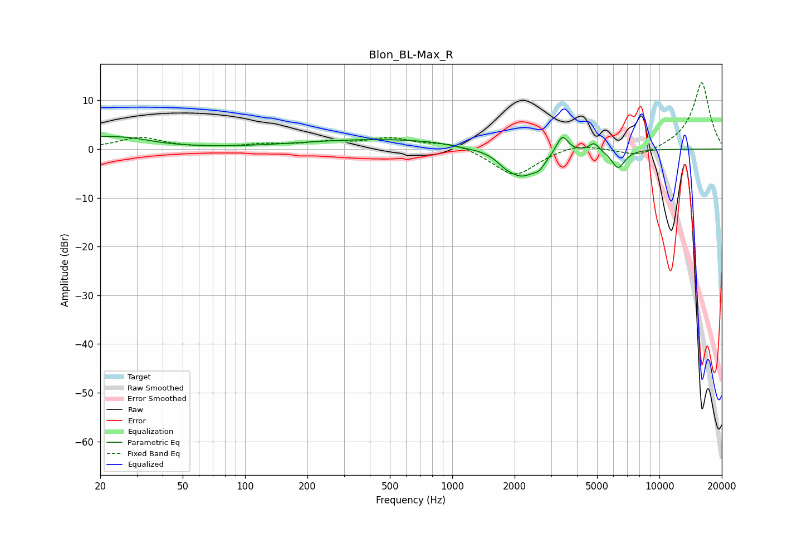

# Blon_BL-Max_R
See [usage instructions](https://github.com/jaakkopasanen/AutoEq#usage) for more options and info.

### Parametric EQs
Apply preamp of -2.7 dB when using parametric equalizer.

|   # | Type    |   Fc (Hz) |    Q |   Gain (dB) |
|-----|---------|-----------|------|-------------|
|   1 | Peaking |        20 | 0.77 |         2.4 |
|   2 | Peaking |        29 | 1.59 |         0.4 |
|   3 | Peaking |       494 | 0.33 |         2.1 |
|   4 | Peaking |      1120 | 1.98 |        -0.3 |
|   5 | Peaking |      1808 | 3.48 |        -1   |
|   6 | Peaking |      2171 | 1.76 |        -5.7 |
|   7 | Peaking |      2630 | 5.4  |        -1.4 |
|   8 | Peaking |      3396 | 4.99 |         3.8 |
|   9 | Peaking |      4844 | 6    |         1.7 |
|  10 | Peaking |      6320 | 4.27 |        -3.8 |

### Fixed Band EQs
When using fixed band (also called graphic) equalizer, apply preamp of **-13.7 dB** (if available) and set gains manually with these parameters.

|   # | Type    |   Fc (Hz) |    Q |   Gain (dB) |
|-----|---------|-----------|------|-------------|
|   1 | Peaking |        31 | 1.41 |         2.3 |
|   2 | Peaking |        62 | 1.41 |         0.1 |
|   3 | Peaking |       125 | 1.41 |         0.8 |
|   4 | Peaking |       250 | 1.41 |         1.2 |
|   5 | Peaking |       500 | 1.41 |         2   |
|   6 | Peaking |      1000 | 1.41 |         1.4 |
|   7 | Peaking |      2000 | 1.41 |        -5.7 |
|   8 | Peaking |      4000 | 1.41 |         1.3 |
|   9 | Peaking |      8000 | 1.41 |        -1.9 |
|  10 | Peaking |     16000 | 1.41 |        13.8 |

### Graphs

