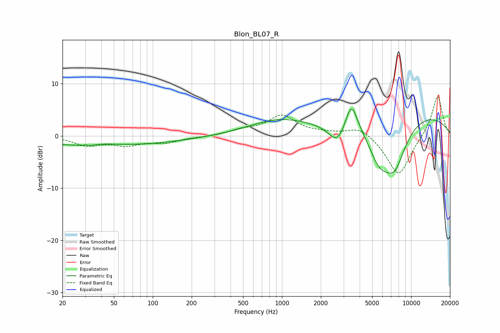

# Blon_BL07_R
See [usage instructions](https://github.com/jaakkopasanen/AutoEq#usage) for more options and info.

### Parametric EQs
Apply preamp of -5.2 dB when using parametric equalizer.

|   # | Type    |   Fc (Hz) |    Q |   Gain (dB) |
|-----|---------|-----------|------|-------------|
|   1 | Peaking |        30 | 5.75 |         0.9 |
|   2 | Peaking |        31 | 4.17 |        -1.1 |
|   3 | Peaking |        39 | 0.22 |        -1.9 |
|   4 | Peaking |        40 | 1.08 |         0.4 |
|   5 | Peaking |       930 | 0.62 |         2.8 |
|   6 | Peaking |      2700 | 2.03 |        -4.2 |
|   7 | Peaking |      3443 | 2.92 |         5.9 |
|   8 | Peaking |      5636 | 1.54 |        -6.2 |
|   9 | Peaking |      7434 | 1.41 |        -8.7 |
|  10 | Peaking |      8695 | 0.25 |         5   |

### Fixed Band EQs
When using fixed band (also called graphic) equalizer, apply preamp of **-7.6 dB** (if available) and set gains manually with these parameters.

|   # | Type    |   Fc (Hz) |    Q |   Gain (dB) |
|-----|---------|-----------|------|-------------|
|   1 | Peaking |        31 | 1.41 |        -1.7 |
|   2 | Peaking |        62 | 1.41 |        -1.6 |
|   3 | Peaking |       125 | 1.41 |        -1.2 |
|   4 | Peaking |       250 | 1.41 |        -0.2 |
|   5 | Peaking |       500 | 1.41 |         1   |
|   6 | Peaking |      1000 | 1.41 |         3.7 |
|   7 | Peaking |      2000 | 1.41 |         0.4 |
|   8 | Peaking |      4000 | 1.41 |         1.9 |
|   9 | Peaking |      8000 | 1.41 |        -7.8 |
|  10 | Peaking |     16000 | 1.41 |         7.9 |

### Graphs

