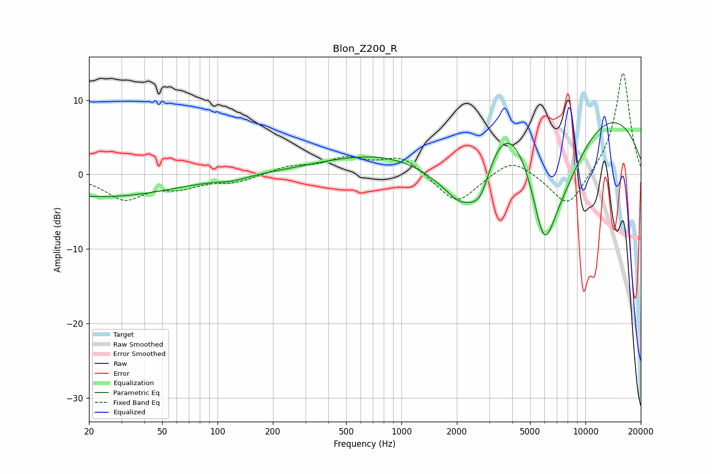

# Blon_Z200_R
See [usage instructions](https://github.com/jaakkopasanen/AutoEq#usage) for more options and info.

### Parametric EQs
Apply preamp of -7.0 dB when using parametric equalizer.

|   # | Type    |   Fc (Hz) |    Q |   Gain (dB) |
|-----|---------|-----------|------|-------------|
|   1 | Peaking |        20 | 2.43 |         0.1 |
|   2 | Peaking |        22 | 0.34 |        -3.1 |
|   3 | Peaking |       122 | 1.87 |        -0.5 |
|   4 | Peaking |      1686 | 0.52 |        -8.8 |
|   5 | Peaking |      2133 | 1.3  |        -6.9 |
|   6 | Peaking |      2694 | 2.3  |        -5.6 |
|   7 | Peaking |      3759 | 0.95 |         4.4 |
|   8 | Peaking |      4859 | 0.19 |        18.4 |
|   9 | Peaking |      5958 | 1.38 |       -17.3 |
|  10 | Peaking |      7432 | 0.74 |        -9.5 |

### Fixed Band EQs
When using fixed band (also called graphic) equalizer, apply preamp of **-13.7 dB** (if available) and set gains manually with these parameters.

|   # | Type    |   Fc (Hz) |    Q |   Gain (dB) |
|-----|---------|-----------|------|-------------|
|   1 | Peaking |        31 | 1.41 |        -3.2 |
|   2 | Peaking |        62 | 1.41 |        -1.5 |
|   3 | Peaking |       125 | 1.41 |        -1   |
|   4 | Peaking |       250 | 1.41 |         1   |
|   5 | Peaking |       500 | 1.41 |         2   |
|   6 | Peaking |      1000 | 1.41 |         2.4 |
|   7 | Peaking |      2000 | 1.41 |        -4.1 |
|   8 | Peaking |      4000 | 1.41 |         2.4 |
|   9 | Peaking |      8000 | 1.41 |        -4.8 |
|  10 | Peaking |     16000 | 1.41 |        13.9 |

### Graphs

