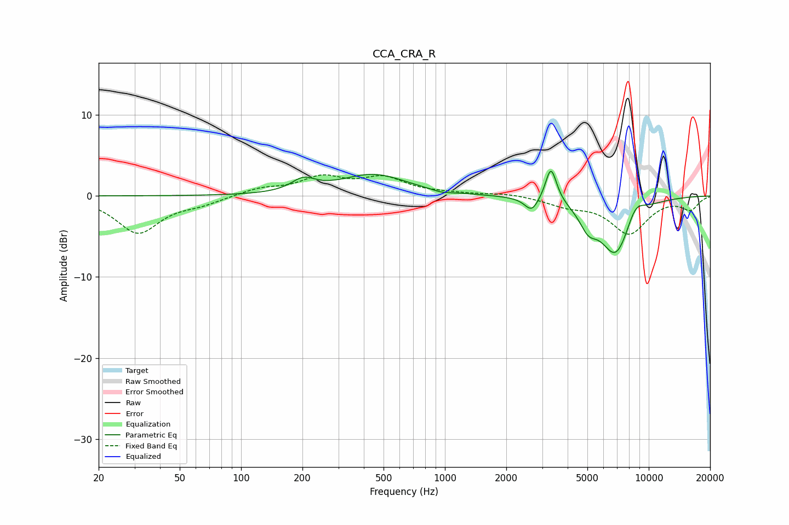

# CCA_CRA_R
See [usage instructions](https://github.com/jaakkopasanen/AutoEq#usage) for more options and info.

### Parametric EQs
Apply preamp of -3.2 dB when using parametric equalizer.

|   # | Type    |   Fc (Hz) |    Q |   Gain (dB) |
|-----|---------|-----------|------|-------------|
|   1 | Peaking |       202 | 2.44 |         1.5 |
|   2 | Peaking |       446 | 0.86 |         2.6 |
|   3 | Peaking |       964 | 2.89 |        -0.3 |
|   4 | Peaking |      2591 | 1.67 |        -0   |
|   5 | Peaking |      2665 | 4.24 |        -1.7 |
|   6 | Peaking |      3301 | 5.56 |         3.2 |
|   7 | Peaking |      3371 | 4.41 |         1.2 |
|   8 | Peaking |      5045 | 3.28 |        -2.3 |
|   9 | Peaking |      6897 | 1.7  |        -7.3 |
|  10 | Peaking |      8577 | 2.8  |         2.2 |

### Fixed Band EQs
When using fixed band (also called graphic) equalizer, apply preamp of **-2.7 dB** (if available) and set gains manually with these parameters.

|   # | Type    |   Fc (Hz) |    Q |   Gain (dB) |
|-----|---------|-----------|------|-------------|
|   1 | Peaking |        31 | 1.41 |        -4.5 |
|   2 | Peaking |        62 | 1.41 |        -0.8 |
|   3 | Peaking |       125 | 1.41 |         0.9 |
|   4 | Peaking |       250 | 1.41 |         2.1 |
|   5 | Peaking |       500 | 1.41 |         2.1 |
|   6 | Peaking |      1000 | 1.41 |         0.2 |
|   7 | Peaking |      2000 | 1.41 |         0.3 |
|   8 | Peaking |      4000 | 1.41 |        -1   |
|   9 | Peaking |      8000 | 1.41 |        -4.5 |
|  10 | Peaking |     16000 | 1.41 |        -1.6 |

### Graphs

