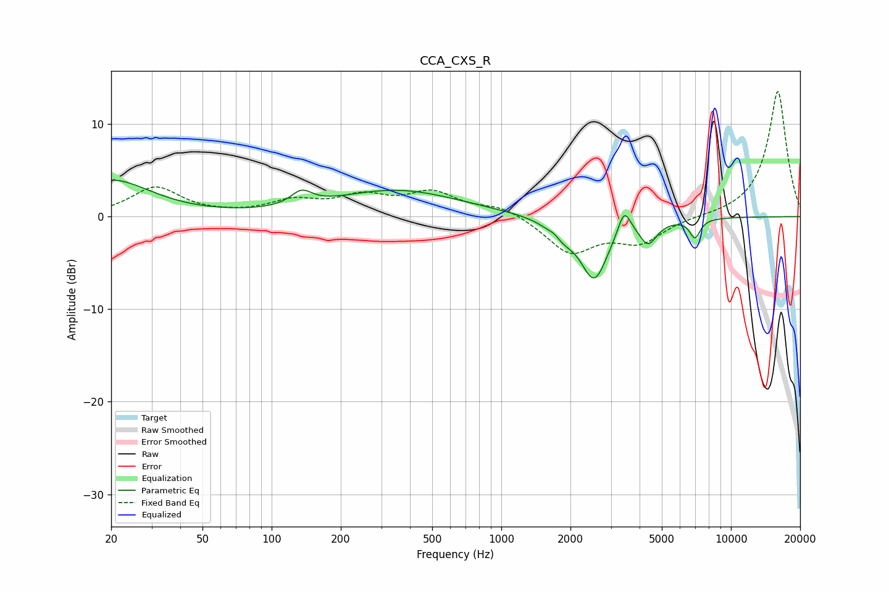

# CCA_CXS_R
See [usage instructions](https://github.com/jaakkopasanen/AutoEq#usage) for more options and info.

### Parametric EQs
Apply preamp of -4.0 dB when using parametric equalizer.

|   # | Type    |   Fc (Hz) |    Q |   Gain (dB) |
|-----|---------|-----------|------|-------------|
|   1 | Peaking |        20 | 0.82 |         3.9 |
|   2 | Peaking |       135 | 3.09 |         1.5 |
|   3 | Peaking |       353 | 0.52 |         2.8 |
|   4 | Peaking |      1711 | 5.97 |         0.5 |
|   5 | Peaking |      1813 | 2.57 |        -1.6 |
|   6 | Peaking |      2541 | 2.36 |        -6.6 |
|   7 | Peaking |      3430 | 5.12 |         2.8 |
|   8 | Peaking |      4179 | 3.65 |         0.7 |
|   9 | Peaking |      4325 | 3.62 |        -3.1 |
|  10 | Peaking |      6970 | 5.94 |        -2   |

### Fixed Band EQs
When using fixed band (also called graphic) equalizer, apply preamp of **-13.6 dB** (if available) and set gains manually with these parameters.

|   # | Type    |   Fc (Hz) |    Q |   Gain (dB) |
|-----|---------|-----------|------|-------------|
|   1 | Peaking |        31 | 1.41 |         3.1 |
|   2 | Peaking |        62 | 1.41 |         0.1 |
|   3 | Peaking |       125 | 1.41 |         1.5 |
|   4 | Peaking |       250 | 1.41 |         1.9 |
|   5 | Peaking |       500 | 1.41 |         2.4 |
|   6 | Peaking |      1000 | 1.41 |         1.1 |
|   7 | Peaking |      2000 | 1.41 |        -3.8 |
|   8 | Peaking |      4000 | 1.41 |        -2.6 |
|   9 | Peaking |      8000 | 1.41 |        -0   |
|  10 | Peaking |     16000 | 1.41 |        13.7 |

### Graphs

