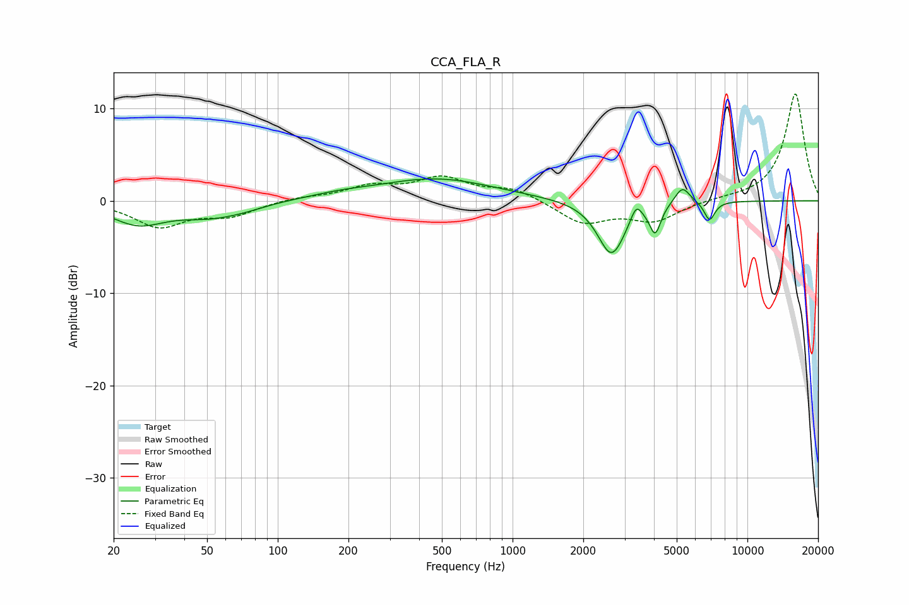

# CCA_FLA_R
See [usage instructions](https://github.com/jaakkopasanen/AutoEq#usage) for more options and info.

### Parametric EQs
Apply preamp of -2.5 dB when using parametric equalizer.

|   # | Type    |   Fc (Hz) |    Q |   Gain (dB) |
|-----|---------|-----------|------|-------------|
|   1 | Peaking |        25 | 1.24 |        -2.3 |
|   2 | Peaking |        51 | 1.06 |        -1.4 |
|   3 | Peaking |        72 | 1.48 |        -0.4 |
|   4 | Peaking |       184 | 1.08 |         0.4 |
|   5 | Peaking |       473 | 0.57 |         2.4 |
|   6 | Peaking |      2638 | 2.39 |        -5.9 |
|   7 | Peaking |      3362 | 6    |         1.7 |
|   8 | Peaking |      4048 | 5.97 |        -3   |
|   9 | Peaking |      5285 | 4.29 |         1.9 |
|  10 | Peaking |      6899 | 6    |        -2.1 |

### Fixed Band EQs
When using fixed band (also called graphic) equalizer, apply preamp of **-11.6 dB** (if available) and set gains manually with these parameters.

|   # | Type    |   Fc (Hz) |    Q |   Gain (dB) |
|-----|---------|-----------|------|-------------|
|   1 | Peaking |        31 | 1.41 |        -2.7 |
|   2 | Peaking |        62 | 1.41 |        -1.5 |
|   3 | Peaking |       125 | 1.41 |         0.4 |
|   4 | Peaking |       250 | 1.41 |         1.4 |
|   5 | Peaking |       500 | 1.41 |         2.3 |
|   6 | Peaking |      1000 | 1.41 |         1.3 |
|   7 | Peaking |      2000 | 1.41 |        -2.4 |
|   8 | Peaking |      4000 | 1.41 |        -2.1 |
|   9 | Peaking |      8000 | 1.41 |         0.2 |
|  10 | Peaking |     16000 | 1.41 |        11.6 |

### Graphs

