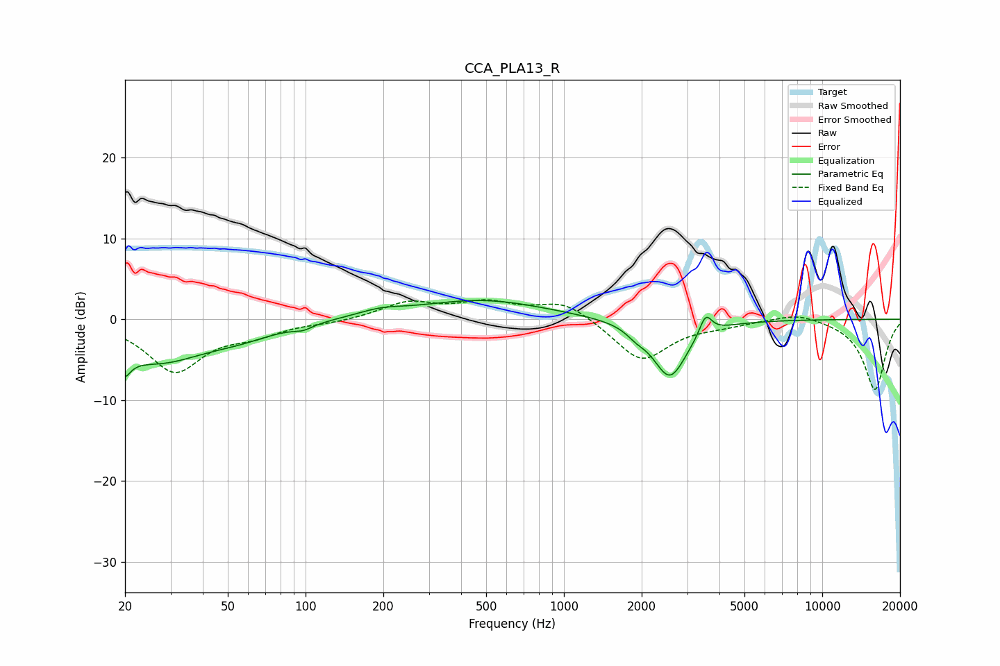

# CCA_PLA13_R
See [usage instructions](https://github.com/jaakkopasanen/AutoEq#usage) for more options and info.

### Parametric EQs
Apply preamp of -2.4 dB when using parametric equalizer.

|   # | Type    |   Fc (Hz) |    Q |   Gain (dB) |
|-----|---------|-----------|------|-------------|
|   1 | Peaking |        20 | 5.54 |        -6.1 |
|   2 | Peaking |        20 | 5.87 |         3.3 |
|   3 | Peaking |        27 | 0.77 |        -4.9 |
|   4 | Peaking |        56 | 0.98 |        -1.3 |
|   5 | Peaking |        98 | 3.79 |        -0.6 |
|   6 | Peaking |       195 | 1.57 |         0.7 |
|   7 | Peaking |       481 | 0.58 |         2.4 |
|   8 | Peaking |      1904 | 3.99 |        -0.8 |
|   9 | Peaking |      2570 | 2.12 |        -7.2 |
|  10 | Peaking |      3536 | 5.96 |         2.5 |

### Fixed Band EQs
When using fixed band (also called graphic) equalizer, apply preamp of **-2.5 dB** (if available) and set gains manually with these parameters.

|   # | Type    |   Fc (Hz) |    Q |   Gain (dB) |
|-----|---------|-----------|------|-------------|
|   1 | Peaking |        31 | 1.41 |        -6.3 |
|   2 | Peaking |        62 | 1.41 |        -1.5 |
|   3 | Peaking |       125 | 1.41 |        -0.3 |
|   4 | Peaking |       250 | 1.41 |         2   |
|   5 | Peaking |       500 | 1.41 |         1.8 |
|   6 | Peaking |      1000 | 1.41 |         2.3 |
|   7 | Peaking |      2000 | 1.41 |        -5.2 |
|   8 | Peaking |      4000 | 1.41 |        -0.5 |
|   9 | Peaking |      8000 | 1.41 |         1   |
|  10 | Peaking |     16000 | 1.41 |        -8.7 |

### Graphs

